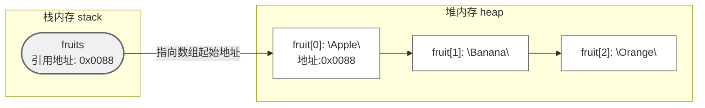
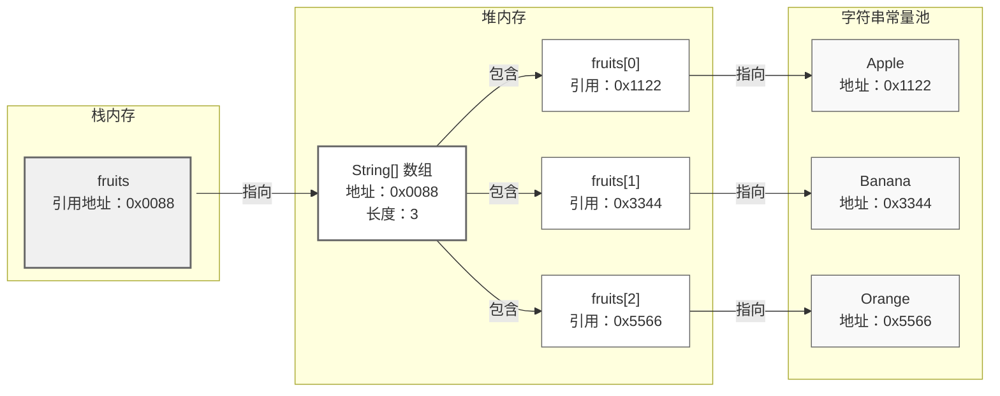
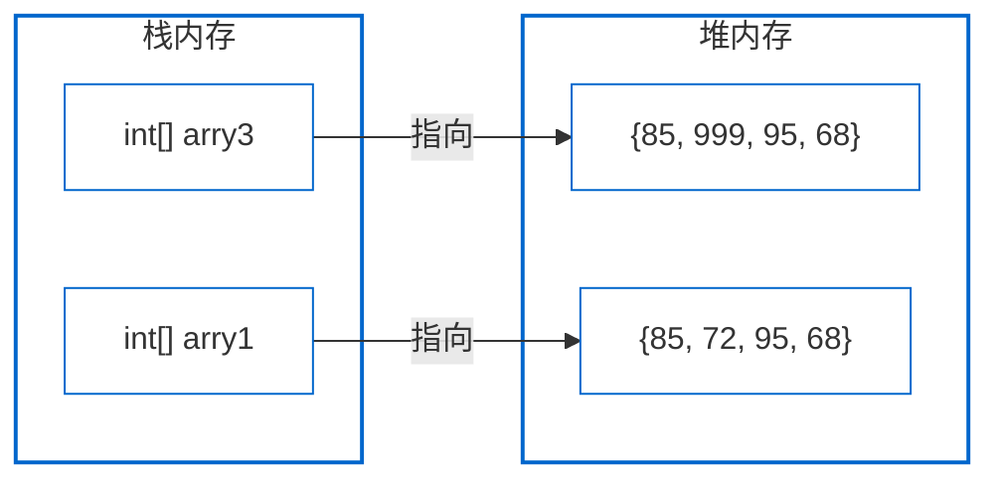

# 知识点列表

| 编号 | 名称                         | 描述                                                         | 级别 |
| ---- | ---------------------------- | ------------------------------------------------------------ | ---- |
| 1    | 数组变量的声明               | 理解，数组变量的声明方式                                     | **   |
| 2    | 数组对象初始化               | 掌握，数组对象的初始化方式                                   | **   |
| 3    | 关键字                       | 了解Java中的关键字，需要知道java中 true, false,  null 丌是关键字，并且goto和const是Java保留 字 | *    |
| 4    | 数组变量、数组对象、数组元素 | 注意三者的区分，理解概念                                     | *    |
| 5    | 数组元素的访问               | 掌握，重点注意数组元素访问过程中的越界问题                   | **   |
| 6    | 数组的复制                   | 掌握，如何使用循环控制语句实现数组复制，掌握Java  API提供的复制数组的方法 | ***  |
| 7    | 数组的动态扩展               | 掌握，如何进行数组扩展                                       | ***  |

# 数组基本概念

数组是 Java 中**引用数据类型**，用于存储**固定长度、同数据类型**的多个元素。其核心特征如下：

- **固定长度**：创建时必须指定长度，后续无法动态扩容（如需扩容需手动拷贝元素）。
- **同类型元素**：数组中所有元素的数据类型一致（如 `int[]` 只能存 `int`，`String[]` 只能存 `String`）。
- **内存布局**：数组引用（变量名）存储在**栈内存**，数组元素存储在**堆内存**，引用指向堆中元素的起始地址。







# 数组的声明与初始化

数组的使用需经过「声明 → 初始化」两步，初始化时会在堆内存中分配空间并赋予默认值。

## 1. 声明语法（2 种方式，推荐第一种）

```java
// 方式1：推荐（明确数组类型，可读性高）
数据类型[] 数组名;
// 方式2：不推荐（易混淆，如 int a[] 可能被误认为“int类型变量a[]”）
数据类型 数组名[];

// 示例
int[] scores;       // 声明int类型数组，存储成绩
String[] names;     // 声明String类型数组，存储姓名
```


## 2. 初始化（3 种方式）

初始化的核心是「分配堆内存空间」并「赋值元素」，分为**动态初始化**（指定长度，元素用默认值）和**静态初始化**（指定元素，长度自动计算）。

#### （1）动态初始化（指定长度）

语法：`数组名 = new 数据类型[长度];`

元素默认值规则：

- 基本类型：`int` 0、`double` 0.0、`boolean` false、`char` '\u0000'（空字符）
- 引用类型：`String`、自定义类等默认值为 `null`

```java
public class ArrayInitDemo1 {
    public static void main(String[] args) {
        //1.声明+动态初始化（一步完成）
        int[] scores =new int[5];// 长度为5的int数组，元素默认0

        // 2. 给数组元素赋值（通过索引）
        scores[0]=90;//第1个元素（索引0）
        scores[1]=85;//第2个元素（索引1）
        scores[2]=98;//第3个元素（索引2）
        scores[3]=87;//第4个元素（索引3）
        scores[4]=92;//第5个元素（索引4）

        // 3. 访问元素
        System.out.println("第3个成绩是："+scores[2]);
        System.out.println("数组的长度是："+scores.length); // 输出：5（length是数组的属性，非方法）
    }
}
```


#### （2）静态初始化（指定元素）

语法：`数组名 = new 数据类型[]{元素1, 元素2, ...};`

可简化为：`数组名 = {元素1, 元素2, ...};`（仅能在声明时使用，不可单独后续赋值）

```java
public class ArrayInitDemo2 {
    public static void main(String[] args) {
        //1.静态初始化数组
        String[] names=new String[]{"Alice","Bob","Charlie"};

        // 2. 简化静态初始化（仅声明时可用）
        int[] ages={18,21,19};

        // 3. 访问元素
        System.out.println("第一个名字是："+names[0]);
        System.out.println("第三个年龄是："+ages[2]);
        System.out.println("名字数组长度是："+names.length);
    }
}

```

#### （3）错误初始化示例（新手避坑）

```java
// 错误1：静态初始化不可拆分（声明后单独用{}赋值）
int[] nums;
// nums = {1,2,3};  // 编译报错！需用 new int[]{1,2,3}

// 错误2：静态初始化不能同时指定长度和元素
// int[] nums = new int[3]{1,2,3};  // 编译报错！长度会自动计算，无需指定
```


# 数组的访问与遍历

数组元素通过「索引（index）」访问，索引从 `0` 开始，最大索引为 `数组长度-1`（超出会报 `ArrayIndexOutOfBoundsException` 数组越界异常）。

## 1. 直接访问（通过索引）

```java
public class ArrayAccessDemo {
    public static void main(String[] args) {
        int[] array={10,20,30,40};

        // 访问第1个元素（索引0）
        System.out.println("第一个元素是："+array[0]);

        // 修改第3个元素（索引2）
        array[2]=35;
        System.out.println("修改后第3个元素：" + array[2]);//35
    }
}

```


## 2. 遍历数组（3 种常用方式）

遍历即 “逐个访问数组元素”，适用于批量操作（如求和、查找、打印）。

#### （1）普通 for 循环（需索引时用，如修改元素）

```java
public class ArrayLoopDemo1 {
    public static void main(String[] args) {
        int[] scores = {85, 92, 78, 95, 88};

        // 遍历数组，计算总成绩
        int total = 0;
        for (int i = 0; i < scores.length; i++) {
            total += scores[i];
            System.out.println("第" + (i+1) + "个成绩：" + scores[i]);
        }
        System.out.println("总成绩：" + total);  // 输出：438
    }
}
```


#### （2）for-each 循环（增强 for 循环，简化遍历，无需索引）

语法：`for (元素类型 变量名 : 数组名) { ... }`

适用于 “仅读取元素”，无法修改元素（变量是元素的副本），也无法获取索引。

```java
public class ArrayLoopDemo2 {
    public static void main(String[] args) {
        String[] fruits = {"Apple", "Banana", "Orange"};

        // for-each遍历，打印所有水果
        System.out.println("水果列表：");
        for(String fruit:fruits){
            System.out.println(fruit);
        }

        // 注意：for-each无法修改原数组元素
        for(String fruit:fruits){
            fruit="Grape";// 仅修改副本，原数组不变
        }
        System.out.println("修改后第一个水果："+fruits[0]);// 仍为Apple

    }
}

```


#### （3）Arrays.toString ()（快速打印数组，需导入工具类）

`java.util.Arrays` 是数组工具类，`toString(数组)` 方法可将数组转为 “`[元素1, 元素2, ...]`” 格式的字符串，方便调试。

```java
public class ArrayLoopDemo3 {
    public static void main(String[] args) {
        int[] arr = {1, 3, 5, 7, 9};

        // 直接打印数组引用（会输出内存地址，无意义）
        System.out.println(arr);//[I@7f31245a  （格式：[类型@哈希值）

        // 用Arrays.toString()打印数组元素
        System.out.println("数组元素：" + Arrays.toString(arr));// 输出：[1, 3, 5, 7, 9]
    }
}

```


# 数组变量, 数组对象, 数组元素

请理解并熟悉这些名词：

```java
public class ArrayDemo3 {
    public static void main(String[] args) {
        //声明和初始化一个数组
        String[] names=new String[]{"Alice","Bob","Charlie"};
        //names ：数组变量
        //new String[]{"Alice","Bob","Charlie"} ：数组对象（存于堆内存的实际数组）
        //"Alice","Bob","Charlie"：数组元素
    }
}
```


# 数组的复制与动态扩展算法

## 1.数组对象的复制

### 数组赋值概念：

```java
public class ArrayCopyDemo {
    public static void main(String[] args) {
        int[] arry1 = new int[]{85, 72, 95, 68};
        //数组的赋值
        int[] arry2=arry1;//一个数组对象，两个引用同时引用

    }
}
```

```java
public class ArrayCopyDemo {
    public static void main(String[] args) {
        int[] arry1 = new int[]{85, 72, 95, 68};
        //数组的赋值
        int[] arry2=arry1;//一个数组对象，两个引用同时引用
        
        System.out.println(arry1[0]);//85
        System.out.println(arry2[0]);//85
        
        arry2[1]=100;
        System.out.println(arry1[1]);//100
        
    }
}
```

这种现象叫数组赋值，可以发现如果这样赋值，数组对象没有隔离性，一不小心就修改了 

所以我们使用数组对象的复制实现数组的隔离性：

```java
public class ArrayCopyDemo {
    public static void main(String[] args) {
        int[] arry1 = new int[]{85, 72, 95, 68};
        
        //数组的复制：2个不同的数组对象
        int[] arry3=new int[arry1.length];//空数组
        for(int i=0;i<arry1.length;i++){//0~3
            arry3[i]=arry1[i];
        }

        //arry3 是arry1 的复制结果，不同的数组对象，arry3和arry1是隔离的
        arry3[1]=999;
        System.out.println(arry1[1]);//72,没有改变
        
    }
}
```





新数组arry3是数组arry1的副本，arry3是新数组 

### 数组的迭代

那么如何输出数组中全部元素？我们使用"数组的迭代"方法，迭代（Iterate）的意思就是"重复"。

```java
public class ArrayIterateDemo {
    public static void main(String[] args) {
        int[] arry1 = new int[]{85, 72, 95, 68};
        //迭代（Iterate）输出每个数组的元素
        for(int i=0;i<arry1.length;i++){
            System.out.println(arry1[i]);
        }
        
    }
}
```


### 数组的复制（4 种方式）

数组长度固定，如需 “扩容” 或 “复制部分元素”，需手动拷贝到新数组。

| 方法                 | 语法示例                                                     | 特点                                                         |
| -------------------- | ------------------------------------------------------------ | ------------------------------------------------------------ |
| System.arraycopy()   | `System.arraycopy(原数组, 原起始索引, 目标数组, 目标起始索引, 拷贝长度);` | native 方法（效率高），需手动创建目标数组，支持部分拷贝      |
| Arrays.copyOf()      | `int[] newArr = Arrays.copyOf(原数组, 新长度);`              | 自动创建目标数组，新长度可大于原长度（补默认值）或小于（截断） |
| Arrays.copyOfRange() | `int[] newArr = Arrays.copyOfRange(原数组, 起始索引, 结束索引);` | 拷贝 “[起始索引，结束索引)” 的元素，自动创建目标数组         |
| 手动拷贝（for 循环） | 遍历原数组，逐个赋值到新数组                                 | 灵活控制拷贝逻辑，适合复杂场景（如过滤元素）                 |

+ System.arraycopy(src , srcPos, dest , destPos , length)：这个方法是 Java API 提供的，底层 是用C++写的，所以速度非常快，比for()循环实现数组拷贝效率要高很多，所以推荐使用。  

+ Arrays.copyOf(src , length)：是 JDK1.6 版本提供的方法，比起System.arraycopy()使用更简 便，但需要注意的是你的开发环境JDK版本必须是1.6及以上。copyOf() 方法的底层就是arraycopy() 方法.


## 2.数组的扩容问题

我们先明确一点，Java数组对象的大小是固定的，数组对象是不能扩容的，我们利用**数组复制的方法可以变通的实现数组扩容**。创建数组副本的同时将数组长度增加就变通的实现了，数组的扩容。

+ System.arraycopy() 可以复制数组 

+ Arrays.copyOf() 可以简便的创建数组副本


示例：Arrays.copyOf () 实现数组扩容

```java
public class ArrayCopyDemo {
    public static void main(String[] args) {
        int[] OldArr={1,2,3};

        // 扩容：原长度3 → 新长度5，新增元素补默认值0
        int[] NewArr= Arrays.copyOf(OldArr,5);

        System.out.println("原数组：" + Arrays.toString(OldArr));  // [1,2,3]
        System.out.println("扩容后数组：" + Arrays.toString(NewArr));  // [1,2,3,0,0]
    }
}
```


# 数组常见操作（含示例）

实际开发中常用的数组操作：求最值、拷贝、排序等，需结合工具类或自定义逻辑实现。

## 1. 求数组最值（最大值 / 最小值）

思路：先假设第一个元素为最值，再遍历数组逐一比较更新。

```java
public class ArrayMaxMinDemo {
    public static void main(String[] args) {
        int[] nums = {15, 8, 23, 7, 30, 12};

        // 求最大值
        int max=nums[0];// 初始值设为第一个元素
        for (int i = 0; i < nums.length; i++) {
            max=nums[i]<max?max:nums[i];
        }

        // 求最小值
        int min=nums[0];// 初始值设为第一个元素
        for (int i = 0; i < nums.length; i++) {
            min=nums[i]<min?nums[i]:min;
        }

        System.out.println("最大值："+max);
        System.out.println("最小值："+min);
    }
}
```


## 2. 数组拷贝（4 种方式）

数组长度固定，如需 “扩容” 或 “复制部分元素”，需手动拷贝到新数组。

| 方法                 | 语法示例                                                     | 特点                                                         |
| -------------------- | ------------------------------------------------------------ | ------------------------------------------------------------ |
| System.arraycopy()   | `System.arraycopy(原数组, 原起始索引, 目标数组, 目标起始索引, 拷贝长度);` | native 方法（效率高），需手动创建目标数组，支持部分拷贝      |
| Arrays.copyOf()      | `int[] newArr = Arrays.copyOf(原数组, 新长度);`              | 自动创建目标数组，新长度可大于原长度（补默认值）或小于（截断） |
| Arrays.copyOfRange() | `int[] newArr = Arrays.copyOfRange(原数组, 起始索引, 结束索引);` | 拷贝 “[起始索引，结束索引)” 的元素，自动创建目标数组         |
| 手动拷贝（for 循环） | 遍历原数组，逐个赋值到新数组                                 | 灵活控制拷贝逻辑，适合复杂场景（如过滤元素）                 |


## 3. 数组排序（Arrays.sort ()）

`Arrays.sort(数组)` 可对数组进行**升序排序**（基本类型：快速排序；引用类型：归并排序），排序后原数组会被修改。

```java
public class ArraySortDemo {
    public static void main(String[] args) {
        int[] scores = {85, 72, 95, 68, 90};

        // 升序排序
        Arrays.sort(scores);

        System.out.println("排序后成绩：" + Arrays.toString(scores));  // [68,72,85,90,95]

        // 降序排序（需手动实现，或用包装类+Comparator）
        Integer[] scoreObj = {85, 72, 95, 68, 90};  // 包装类数组
        Arrays.sort(scoreObj, (a, b) -> b - a);  // lambda表达式实现降序
        System.out.println("降序排序成绩：" + Arrays.toString(scoreObj));  // [95,90,85,72,68]
    }
}
```


# 二维数组（数组的数组）

二维数组用于存储 “表格型数据”（如矩阵、多行多列数据），本质是 “数组的数组”—— 外层数组的每个元素都是一个一维数组。

## 1. 声明与初始化

### （1）动态初始化（指定外层长度，内层长度可后续指定）

```java
public class TwoDArrayDemo1 {
    public static void main(String[] args) {
        // 1. 声明二维数组（3行，列数暂不指定）
        int[][] matrix = new int[3][];

        // 2. 给每行（内层数组）赋值
        matrix[0] = new int[2];  // 第1行：2列
        matrix[1] = new int[3];  // 第2行：3列
        matrix[2] = new int[]{10, 20, 30, 40};  // 第3行：4列（静态初始化）

        // 3. 给元素赋值
        matrix[0][0] = 1;
        matrix[0][1] = 2;
        matrix[1][1] = 5;

        // 打印二维数组（需用Arrays.deepToString()）
        System.out.println(Arrays.deepToString(matrix));
        // 输出：[[1, 2], [0, 5, 0], [10, 20, 30, 40]]

    }
}

```


#### （2）静态初始化（直接指定所有元素）

```java
public class TwoDArrayDemo2 {
    public static void main(String[] args) {
        // 静态初始化：3行2列的二维数组
        int[][] scores = {
                {85, 92},   // 第1行（学生1的语文、数学成绩）
                {78, 88},   // 第2行（学生2）
                {95, 90}    // 第3行（学生3）
        };

        // 遍历二维数组（双层for循环）
        System.out.println("学生成绩表：");
        for (int i = 0; i < scores.length; i++) {  // 外层循环：行
            for (int j = 0; j < scores[i].length; j++) {  // 内层循环：列
                System.out.print(scores[i][j] + "\t");
            }
            System.out.println();  // 换行
        }
    }
}

```

输出结果：

```txt
学生成绩表：
85	92	
78	88	
95	90	
```

# 数组常见问题与注意事项

1. **数组越界异常（ArrayIndexOutOfBoundsException）**原因：访问的索引 < 0 或 ≥ 数组长度。解决：确保索引范围 `0 ≤ 索引 < 数组.length`，遍历用 `i < 数组.length` 而非固定值。
2. **空指针异常（NullPointerException）**原因：数组引用为 `null` 时访问元素（如 `int[] arr = null; arr[0] = 1;`）。解决：先初始化数组（`arr = new int[5];`），再访问元素。
3. **数组长度不可变**数组创建后长度固定，如需 “增删元素”，需创建新数组并拷贝原元素（如用 `Arrays.copyOf()` 扩容）。
4. **引用类型数组存储的是地址**如 `String[] arr = new String[3];`，数组元素存储的是 `String` 对象的引用（默认 `null`），需手动创建 `String` 对象（`arr[0] = "abc";`）。


# 数组 vs 集合（ArrayList）

| 对比维度 | 数组（Array）        | 集合（如 ArrayList）               |
| -------- | -------------------- | ---------------------------------- |
| 长度     | 固定                 | 动态可变（自动扩容）               |
| 元素类型 | 仅同类型             | 泛型指定（同类型，可存对象）       |
| 功能     | 基础存储，无额外方法 | 自带增删查改方法（add、remove 等） |
| 内存效率 | 高（无额外开销）     | 低（需维护扩容机制、元素指针）     |
| 适用场景 | 长度固定、频繁查询   | 长度不确定、频繁增删               |

# 总结

数组是 Java 中最基础的容器，核心是 “固定长度、同类型元素、索引访问”。需掌握：

- 声明初始化的 3 种方式；
- 3 种遍历方法（普通 for、for-each、Arrays.toString ()）；
- 常见操作（求最值、拷贝、排序）；
- 二维数组的使用与遍历；
- 避坑（越界、空指针、长度不可变）。

实际开发中，若需动态长度，优先用 `ArrayList`；若长度固定且需高效查询，用数组。


# 实践

## 班级成绩管理系统（规则二维数组）

需求：统计 3 个班级的总分、平均分、最高分，并打印成绩表。

```java
public class ScoreManager {
    public static void main(String[] args) {
        // 1. 初始化3个班级的成绩（规则二维数组）
        int[][] classScores = {
            {85, 72, 95, 68, 90},  // 一班（5人）
            {92, 88, 79, 85, 82},  // 二班（5人）
            {78, 90, 81, 89, 75}   // 三班（5人）
        };

        // 2. 遍历并统计
        for (int i = 0; i < classScores.length; i++) {
            int classSum = 0;  // 班级总分
            int classMax = classScores[i][0];  // 班级最高分
            int classSize = classScores[i].length;  // 班级人数

            // 统计当前班级的总分和最高分
            for (int score : classScores[i]) {
                classSum += score;
                if (score > classMax) {
                    classMax = score;
                }
            }

            // 计算平均分（保留1位小数）
            double classAvg = classSum * 1.0 / classSize;

            // 打印结果
            System.out.println("=== 第" + (i+1) + "班成绩 ===");
            System.out.println("成绩列表：" + Arrays.toString(classScores[i]));
            System.out.println("总分：" + classSum + "，平均分：" + String.format("%.1f", classAvg) + "，最高分：" + classMax);
            System.out.println();
        }
    }
}
```

```tex
=== 第1班成绩 ===
成绩列表：[85, 72, 95, 68, 90]
总分：410，平均分：82.0，最高分：95

=== 第2班成绩 ===
成绩列表：[92, 88, 79, 85, 82]
总分：426，平均分：85.2，最高分：92

=== 第3班成绩 ===
成绩列表：[78, 90, 81, 89, 75]
总分：413，平均分：82.6，最高分：90
```

