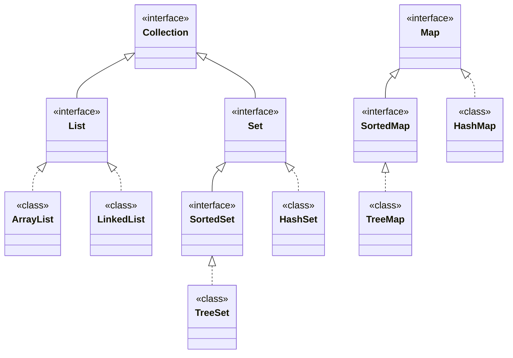

# 知识点列表

| 编号 | 名称                | 描述                                                   | 级别 |
| ---- | ------------------- | ------------------------------------------------------ | ---- |
| 1    | List 核心概念与特性 | 有序可重复集合的定义、核心特点                         | **   |
| 2    | Set 核心概念与特性  | 无序不可重复集合的定义、核心特点                       | **   |
| 3    | Map 核心概念与特性  |                                                        | **   |
| 4    | 主要实现类对比      | ArrayList/LinkedList、HashSet/TreeSet 的底层实现与差异 | **   |
| 5    | 常用 API 与基础操作 | 增删改查等核心方法的使用                               | **   |
| 6    | 遍历方式与效率对比  | 三种遍历方式的实现与性能差异                           | **   |
| 7    | 应用场景选择        | 基于特性的 List 与 Set 使用场景决策                    |      |

# 集合框架（List和Set）的核心概念

集合框架是 Java 提供的统一存储、操作数据的容器体系，**List 与 Set 是 Collection 接口的两大核心子接口**，用于解决不同场景下的数据存储需求：

## 1. List 接口

- 定义：**有序、可重复**的集合（元素存入顺序 = 取出顺序，允许存储重复元素）。
- 核心特点：
  - 支持**索引访问**（类似数组，可通过下标操作元素，如`get(int index)`）。
  - 元素可重复（`equals()`方法判断重复，重复元素会被正常存储）。
  - 有序性（通过维护元素的插入顺序实现，并非排序后的顺序）。
- 设计思想：模拟 "动态数组"，兼顾数组的随机访问优势与灵活扩容能力。

## 2. Set 接口

- 定义：**无序、不可重复**的集合（元素存入顺序≠取出顺序，不允许存储重复元素）。
- 核心特点：
  - 不支持索引访问（无下标概念，不能通过`get(index)`获取元素）。
  - 元素不可重复（新增元素时，通过`hashCode()`和`equals()`判断是否重复，重复元素会被过滤）。
  - 无序性（存储位置由元素的哈希值或排序规则决定，与插入顺序无关）。
- 设计思想：用于需要 "去重" 的场景，提供高效的元素唯一性判断。

## 3. 集合接口图示




## 注意：

 Collection 接口 表示集合的概念
* List 接口
* Set 接口

 List 接口 表示有序线性表的概念
* ArrayList 底层实现是数组
* LinkedList 底层实现是链表

 Set 接口 表示无序不重复的概念
* HashSet


# 集合框架（List和Set）的特性与实现类

List 与 Set 均为接口，需通过具体实现类创建对象，不同实现类的底层结构决定了其性能特点。


# List

## List 接口主要实现类

### 1. ArrayList（核心实现类）

- 底层实现：**动态数组**（初始容量 10，扩容时默认扩容为原容量的 1.5 倍）。
- 核心特性：
  - 随机访问效率高（通过数组下标直接定位，时间复杂度 O (1)）。
  - 插入 / 删除效率低（需移动数组元素，时间复杂度 O (n)）。
- 适用场景：查询操作频繁、插入删除操作较少的场景（如展示列表、数据缓存）。

### 2. LinkedList

- 底层实现：**双向链表**（每个节点存储元素、前驱节点引用、后继节点引用）。
- 核心特性：
  - 随机访问效率低（需从头 / 尾遍历查找，时间复杂度 O (n)）。
  - 插入 / 删除效率高（仅需修改节点引用，时间复杂度 O (1)，前提是已找到目标位置）。
- 额外能力：实现了 Deque 接口，可作为队列、栈使用。
- 适用场景：插入删除操作频繁、查询操作较少的场景（如消息队列、任务队列）。


## 案例：链表数据结构


```java
public class LinkedDemo {
    public static void main(String[] args) {
        Node head = new Node("黑桃10");
        head.next = new Node("黑桃J");
        head.next.next = new Node("黑桃Q");
        head.next.next.next  = new Node("黑桃K");
        System.out.println(head);
    }
}

    //链表中的节点
    class Node{
        Object value;
        Node next;
        public Node(Object obj) {
            value = obj;
        }

        @Override
        public String toString() {
            return next==null?value.toString():value+","+next;
        }
    }
```


# Set

## Set 接口主要实现类

### 1. HashSet（核心实现类）

- 底层实现：**哈希表**（数组 + 链表 / 红黑树，JDK8 后链表长度 > 8 时转为红黑树）。
- 核心特性：
  - 无序性（元素存储位置由`hashCode()`决定）。
  - 去重规则：先通过`hashCode()`判断哈希值，若哈希值不同则直接存储；若哈希值相同，再通过`equals()`判断是否为同一元素，相同则拒绝存储。
  - 效率高（添加、删除、查询的平均时间复杂度 O (1)）。
- 注意：存储的元素需重写`hashCode()`和`equals()`方法，否则无法正确去重。
- 适用场景：无需排序、需高效去重的场景（如存储用户 ID、标签集合）。

### 2. TreeSet

- 底层实现：**红黑树**（平衡二叉搜索树）。
- 核心特性：
  - 有序性（默认按元素自然顺序排序，或通过`Comparator`自定义排序规则）。
  - 去重规则：基于排序规则判断，若元素排序后相等则视为重复（无需重写`hashCode()`和`equals()`，但建议重写）。
  - 效率：添加、删除、查询的时间复杂度 O (log n)（红黑树的平衡特性保证）。
- 适用场景：需要排序且去重的场景（如排行榜、有序数据去重）。


# 集合框架（List和Set)的基本示例

## 1. List 接口使用示例（ArrayList）

```java
import java.util.ArrayList;
import java.util.List;

public class ListDemo {
    public static void main(String[] args) {
        // 1. 创建List集合（多态：接口引用指向实现类对象）
        List<String> list = new ArrayList<>();

        // 2. 添加元素（支持重复元素）
        list.add("Java");
        list.add("Python");
        list.add("Java"); // 重复元素，正常存储
        list.add(1, "C++"); // 插入到指定索引位置

        System.out.println("List集合内容：" + list); 
        // 输出：[Java, C++, Python, Java]（有序，保留插入顺序）

        // 3. 索引访问（List特有）
        String element = list.get(2);
        System.out.println("索引2的元素：" + element); // 输出：Python

        // 4. 修改元素
        list.set(3, "JavaScript"); // 将索引3的元素替换
        System.out.println("修改后：" + list); // 输出：[Java, C++, Python, JavaScript]

        // 5. 删除元素（按索引/元素）
        list.remove(1); // 删除索引1的元素
        list.remove("Java"); // 删除第一个匹配的元素
        System.out.println("删除后：" + list); // 输出：[Python, JavaScript]

        // 6. 遍历（增强for循环）
        System.out.println("遍历结果：");
        for (String s : list) {
            System.out.println(s);
        }
    }
}
```

## 2. Set 接口使用示例（HashSet）

```java
import java.util.HashSet;
import java.util.Set;

public class SetDemo {
    public static void main(String[] args) {
        // 1. 创建Set集合（多态：接口引用指向实现类对象）
        Set<String> set = new HashSet<>();

        // 2. 添加元素（自动去重）
        set.add("Java");
        set.add("Python");
        set.add("Java"); // 重复元素，添加失败
        set.add("C++");

        System.out.println("Set集合内容：" + set); 
        // 输出：[Java, C++, Python]（无序，无重复）

        // 3. 不支持索引访问（以下代码编译报错）
        // String element = set.get(0); 

        // 4. 删除元素（按元素值）
        set.remove("Python");
        System.out.println("删除后：" + set); // 输出：[Java, C++]

        // 5. 遍历（增强for循环）
        System.out.println("遍历结果：");
        for (String s : set) {
            System.out.println(s);
        }
    }
}
```

## 3. TreeSet 排序示例

```java
import java.util.Set;
import java.util.TreeSet;

public class TreeSetDemo {
    public static void main(String[] args) {
        // 1. 自然排序（String默认按字典序）
        Set<String> treeSet1 = new TreeSet<>();
        treeSet1.add("Banana");
        treeSet1.add("Apple");
        treeSet1.add("Cherry");
        System.out.println("自然排序：" + treeSet1); 
        // 输出：[Apple, Banana, Cherry]（有序）

        // 2. 自定义排序（整数降序）
        Set<Integer> treeSet2 = new TreeSet<>((a, b) -> b - a); // lambda表达式指定排序规则
        treeSet2.add(3);
        treeSet2.add(1);
        treeSet2.add(2);
        System.out.println("自定义降序：" + treeSet2); 
        // 输出：[3, 2, 1]
    }
}
```


# 集合框架（List和Set）的核心对比

| 对比维度        | List 接口                                                | Set 接口                                     |
| --------------- | -------------------------------------------------------- | -------------------------------------------- |
| 有序性          | 有序（插入顺序 = 取出顺序）                              | 无序（HashSet）/ 有序（TreeSet，按排序规则） |
| 重复性          | 允许重复元素                                             | 不允许重复元素                               |
| 索引支持        | 支持（可通过下标操作）                                   | 不支持（无下标概念）                         |
| 底层实现        | ArrayList（数组）、LinkedList（双向链表）                | HashSet（哈希表）、TreeSet（红黑树）         |
| 线程安全        | 非线程安全（多线程需手动同步）                           | 非线程安全（多线程需手动同步）               |
| 查找效率        | ArrayList（O(1)）、LinkedList（O(n)）                    | HashSet（O(1)）、TreeSet（O(log n)）         |
| 插入 / 删除效率 | ArrayList（尾部 O (1)，中间 O (n)）、LinkedList（O (1)） | HashSet（O(1)）、TreeSet（O(log n)）         |
| 去重能力        | 无（需手动实现去重）                                     | 有（自动去重）                               |


# 集合框架（List和Set）的常用 API 与遍历方式

## 一、通用核心 API（Collection 接口继承）

| 方法                 | 功能描述                                         |
| -------------------- | ------------------------------------------------ |
| `add(E e)`           | 添加元素（List 返回 true，Set 重复时返回 false） |
| `remove(Object o)`   | 删除指定元素                                     |
| `contains(Object o)` | 判断是否包含指定元素                             |
| `size()`             | 获取集合元素个数                                 |
| `isEmpty()`          | 判断集合是否为空                                 |
| `clear()`            | 清空集合所有元素                                 |
| `iterator()`         | 获取迭代器（用于遍历）                           |

## 二、List 特有 API

| 方法                    | 功能描述                                   |
| ----------------------- | ------------------------------------------ |
| `get(int index)`        | 获取指定索引的元素                         |
| `set(int index, E e)`   | 替换指定索引的元素                         |
| `add(int index, E e)`   | 在指定索引插入元素                         |
| `remove(int index)`     | 删除指定索引的元素                         |
| `indexOf(Object o)`     | 获取元素第一次出现的索引（未找到返回 - 1） |
| `lastIndexOf(Object o)` | 获取元素最后一次出现的索引                 |

## 三、三种遍历方式对比

```java
import java.util.ArrayList;
import java.util.Iterator;
import java.util.List;

public class TraversalDemo {
    public static void main(String[] args) {
        List<String> list = new ArrayList<>();
        list.add("Java");
        list.add("Python");
        list.add("C++");

        // 1. 普通for循环（List特有，依赖索引）
        System.out.println("普通for循环：");
        for (int i = 0; i < list.size(); i++) {
            System.out.println(list.get(i));
        }

        // 2. 增强for循环（List/Set通用，简洁）
        System.out.println("\n增强for循环：");
        for (String s : list) {
            System.out.println(s);
        }

        // 3. 迭代器（List/Set通用，支持遍历中删除）
        System.out.println("\n迭代器遍历：");
        Iterator<String> iterator = list.iterator();
        while (iterator.hasNext()) {
            String s = iterator.next();
            if (s.equals("Python")) {
                iterator.remove(); // 安全删除（避免ConcurrentModificationException）
            }
            System.out.println(s);
        }
        System.out.println("删除后集合：" + list); // 输出：[Java, C++]
    }
}
```

# 应用场景选择

## 1. 优先使用 List 的场景

- 需要按插入顺序存储数据（如用户操作日志、订单列表）。
- 需要通过索引快速访问元素（如分页数据、排行榜名次查询）。
- 允许存储重复数据（如购物车商品，可添加多个相同商品）。
- 频繁插入删除操作集中在集合首尾（LinkedList）。

## 2. 优先使用 Set 的场景

- 需要自动去重（如用户标签、已选商品 ID 集合）。
- 无需索引访问，追求高效的添加 / 查询 / 删除（HashSet）。
- 需要有序且去重的数据（如按价格排序的商品集合、成绩排行榜，TreeSet）。


# 集合框架（List和Set）的优缺点

## 一、List 实现类优缺点

| 实现类     | 优点                                            | 缺点                                                         |
| ---------- | ----------------------------------------------- | ------------------------------------------------------------ |
| ArrayList  | 随机访问效率极高（O (1)）、实现简单、占用内存少 | 中间插入 / 删除效率低（O (n)）、扩容时消耗资源               |
| LinkedList | 首尾插入 / 删除效率极高（O (1)）、无需扩容      | 随机访问效率低（O (n)）、每个节点额外存储前后引用，占用内存多 |

## 二、Set 实现类优缺点

| 实现类  | 优点                                        | 缺点                                                         |
| ------- | ------------------------------------------- | ------------------------------------------------------------ |
| HashSet | 添加 / 查询 / 删除效率高（O (1)）、性能优异 | 无序存储，无法按插入顺序遍历                                 |
| TreeSet | 自动排序、去重，支持自定义排序规则          | 效率低于 HashSet（O (log n)）、排序规则依赖元素实现 Comparable 或手动指定 Comparator |


# 集合框架（List和Set）的核心总结

1. **核心区别**：List 是 “有序可重复”（支持索引），Set 是 “无序不可重复”（无索引），这是选择使用的核心依据。
2. **实现类选择**：List 优先选 ArrayList（查询多）/LinkedList（插入删除多）；Set 优先选 HashSet（高效去重）/TreeSet（排序 + 去重）。
3. **去重规则**：HashSet 依赖`hashCode()`和`equals()`，TreeSet 依赖排序规则，List 需手动去重。
4. **遍历方式**：List 支持三种遍历（普通 for / 增强 for / 迭代器），Set 仅支持增强 for 和迭代器。

# 实践


