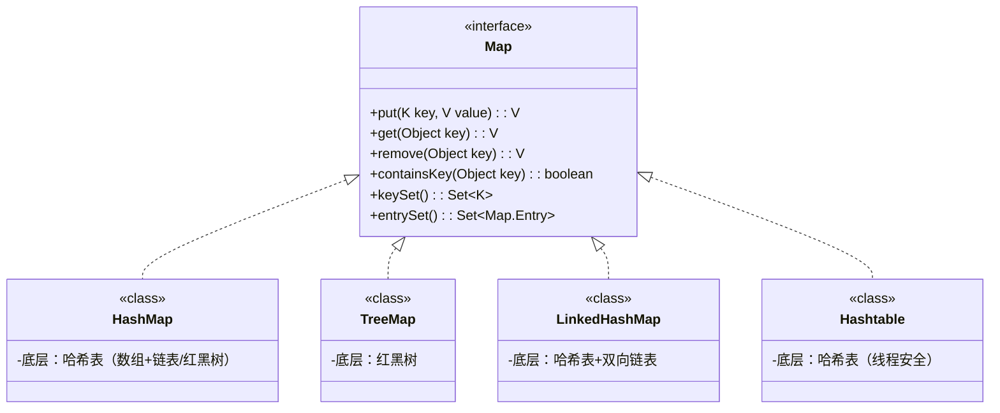

# 知识点列表

| 编号 | 名称             | 描述                                       | 级别 |
| ---- | ---------------- | ------------------------------------------ | ---- |
| 1    | Map 核心概念     | 键值对存储结构的定义与本质                 | **   |
| 2    | Map 接口核心特性 | key 唯一性、键值映射关系、多态应用         | **   |
| 3    | 常用实现类对比   | HashMap/TreeMap/LinkedHashMap 的底层与特点 | **   |
| 4    | Map 核心方法     | put/get/remove/containsKey 等核心操作      | **   |
| 5    | Map 的遍历方式   | 键遍历、值遍历、键值对遍历                 | **   |
| 6    | key 的设计要求   | equals 与 hashCode 方法的重写规范          | **   |
| 7    | Map 的多态应用   | 父接口引用指向子类实现对象                 | **   |
| 8    | 线程安全的 Map   | Hashtable、ConcurrentHashMap 的使用        | *    |


# 集合（Map）的核心概念

Map 是 Java 集合框架中**键值对（key-value）存储结构**的顶层接口，与 Collection 体系（单值存储）并列，是开发中最常用的数据结构之一。

- 定义：专门用于存储 “键 - 值” 映射关系，通过唯一的 key 快速查找对应的 value（key→value 的一对一映射）。
- 本质：基于 “哈希表” 或 “红黑树” 实现的映射表，核心是 “key 的唯一性” 和 “高效查询”。
- 核心特点：
  1. key 不可重复（若重复存入，新 value 会覆盖旧 value）；
  2. value 可重复（多个 key 可对应相同 value）；
  3. 无序 / 有序视实现类而定（HashMap 无序，TreeMap 自然有序，LinkedHashMap 插入有序）；
  4. 支持 null 键 / 值（HashMap 允许 1 个 null key 和多个 null value，TreeMap 不允许 null key）。

# 集合（Map）的核心结构（接口与实现类）

Map 是顶层接口，提供了键值对操作的统一规范，常用实现类基于不同底层结构，满足不同业务场景，体现了**多态的设计思想**（父接口引用指向子类实现对象）。

## 1. 接口与实现类关系（多态体现）




## 2. 常用实现类对比（重点）

| 实现类        | 底层结构                             | 核心特点                           | 有序性   | 线程安全 | 适用场景                              |
| ------------- | ------------------------------------ | ---------------------------------- | -------- | -------- | ------------------------------------- |
| HashMap       | 哈希表（JDK8：数组 + 链表 + 红黑树） | 查询、插入、删除效率高（O (1)）    | 无序     | 否       | 绝大多数场景（无有序 / 线程安全需求） |
| TreeMap       | 红黑树                               | 按 key 自然排序（或自定义排序）    | 自然有序 | 否       | 需要键排序的场景（如排行榜）          |
| LinkedHashMap | 哈希表 + 双向链表                    | 保留插入顺序，查询效率接近 HashMap | 插入有序 | 否       | 需要记录插入顺序的场景（如缓存）      |
| Hashtable     | 哈希表（古老实现）                   | 线程安全（效率低，已被淘汰）       | 无序     | 是       |                                       |


# 集合（Map）的基本示例

以下示例基于 HashMap（最常用实现类），展示 Map 的创建、添加、查询、遍历、删除等核心操作，体现多态的应用（`Map<String, Integer> map = new HashMap<>()`）。

## 1. 核心操作完整示例

```java
import java.util.*;

public class MapBasicDemo {
    public static void main(String[] args) {
        // 1. 创建Map对象（多态：父接口引用指向子类实现）
        Map<String, Integer> studentScores = new HashMap<>();

        // 2. 添加键值对（put方法：key不存在则新增，存在则覆盖）
        studentScores.put("张三", 95);
        studentScores.put("李四", 88);
        studentScores.put("王五", 92);
        studentScores.put("张三", 98);  // key重复，覆盖旧值（95→98）
        studentScores.put(null, 60);   // HashMap允许null key
        studentScores.put("赵六", null); // 允许null value

        System.out.println("Map内容：" + studentScores);
        // 输出（无序）：{null=60, 李四=88, 张三=98, 王五=92, 赵六=null}

        // 3. 查询操作
        // 3.1 根据key获取value（key不存在返回null）
        Integer zhangSanScore = studentScores.get("张三");
        System.out.println("张三的成绩：" + zhangSanScore); // 输出：98

        // 3.2 判断key是否存在
        boolean hasLiSi = studentScores.containsKey("李四");
        System.out.println("是否包含李四：" + hasLiSi); // 输出：true

        // 3.3 判断value是否存在
        boolean hasScore92 = studentScores.containsValue(92);
        System.out.println("是否有92分：" + hasScore92); // 输出：true

        // 4. 遍历Map（三种常用方式）
        System.out.println("\n=== 方式1：遍历所有key，再获取value ===");
        Set<String> keys = studentScores.keySet(); // 获取所有key的集合
        for (String key : keys) {
            Integer value = studentScores.get(key);
            System.out.println(key + "：" + value);
        }

        System.out.println("\n=== 方式2：遍历所有value（无法直接获取key） ===");
        Collection<Integer> values = studentScores.values(); // 获取所有value的集合
        for (Integer value : values) {
            System.out.println("成绩：" + value);
        }

        System.out.println("\n=== 方式3：遍历键值对（推荐，效率最高） ===");
        Set<Map.Entry<String, Integer>> entrySet = studentScores.entrySet();
        for (Map.Entry<String, Integer> entry : entrySet) {
            String key = entry.getKey();
            Integer value = entry.getValue();
            System.out.println(key + "：" + value);
        }

        // 5. 删除操作
        studentScores.remove("王五"); // 根据key删除
        System.out.println("\n删除王五后：" + studentScores);
        // 输出：{null=60, 李四=88, 张三=98, 赵六=null}

        // 6. 其他常用方法
        System.out.println("Map大小：" + studentScores.size()); // 输出：4
        studentScores.clear(); // 清空所有键值对
        System.out.println("清空后是否为空：" + studentScores.isEmpty()); // 输出：true
    }
}
```


# 集合（Map）的关键特性与注意事项

## 1. key 的唯一性保障（核心）

Map 的 key 唯一是通过 **`equals()`和`hashCode()`方法 ** 实现的，规则如下：

- 两个 key 的`hashCode()`返回值相同，且`equals()`返回`true`，则视为同一个 key；
- 若自定义对象作为 key，必须重写`equals()`和`hashCode()`方法（否则使用 Object 类的默认实现，仅比较地址，导致 key 无法去重）。

### 示例：自定义对象作为 key（必须重写方法）

```java
import java.util.HashMap;
import java.util.Map;

// 自定义User类作为Map的key
class User {
    private String id;
    private String name;

    public User(String id, String name) {
        this.id = id;
        this.name = name;
    }

    // 必须重写equals()和hashCode()（ID相同则视为同一个用户）
    @Override
    public boolean equals(Object o) {
        if (this == o) return true;
        if (o == null || getClass() != o.getClass()) return false;
        User user = (User) o;
        return id.equals(user.id);
    }

    @Override
    public int hashCode() {
        return id.hashCode();
    }

    @Override
    public String toString() {
        return "User{id='" + id + "', name='" + name + "'}";
    }
}

public class CustomKeyDemo {
    public static void main(String[] args) {
        Map<User, String> userMap = new HashMap<>();
        userMap.put(new User("1001", "张三"), "北京");
        userMap.put(new User("1001", "张三"), "上海"); // ID相同，视为同一个key，覆盖value

        System.out.println(userMap);
        // 输出：{User{id='1001', name='张三'}=上海}（key去重成功）
    }
}
```

### 2. 多态的深度应用

Map 接口的设计充分体现了多态思想，核心价值：

- 声明时使用父接口`Map`类型，实现时可灵活切换`HashMap`/`TreeMap`等子类；
- 方法参数声明为`Map`类型，可接收任意实现类对象，提高代码通用性。

### 示例：多态切换实现类

```java
import java.util.Map;
import java.util.HashMap;
import java.util.TreeMap;

public class MapPolymorphismDemo {
    // 方法参数为Map类型，支持任意实现类
    public static void printMap(Map<String, Integer> map) {
        System.out.println("Map内容：" + map);
    }

    public static void main(String[] args) {
        // 1. 无序Map（HashMap）
        Map<String, Integer> hashMap = new HashMap<>();
        hashMap.put("b", 2);
        hashMap.put("a", 1);
        printMap(hashMap); // 输出：Map内容：{a=1, b=2}（HashMap无序，JDK8后排序优化）

        // 2. 自然有序Map（TreeMap）
        Map<String, Integer> treeMap = new TreeMap<>();
        treeMap.put("b", 2);
        treeMap.put("a", 1);
        printMap(treeMap); // 输出：Map内容：{a=1, b=2}（按key自然排序）
    }
}
```

## 3. 线程安全问题

- 常用实现类（HashMap、TreeMap、LinkedHashMap）均**非线程安全**（多线程并发修改可能导致数据异常）；
- 解决方案：
  1. 使用`Collections.synchronizedMap(Map)`包装（简单但效率低）；
  2. 使用`ConcurrentHashMap`（推荐，JDK8 后基于 CAS 实现，高效线程安全）。

### 示例：线程安全的 ConcurrentHashMap

```java
import java.util.Map;
import java.util.concurrent.ConcurrentHashMap;

public class ConcurrentMapDemo {
    public static void main(String[] args) {
        Map<String, Integer> concurrentMap = new ConcurrentHashMap<>();
        
        // 多线程并发操作（安全）
        new Thread(() -> concurrentMap.put("a", 1)).start();
        new Thread(() -> concurrentMap.put("b", 2)).start();
        
        // 主线程等待子线程执行完毕
        try {
            Thread.sleep(100);
        } catch (InterruptedException e) {
            e.printStackTrace();
        }
        
        System.out.println("ConcurrentHashMap内容：" + concurrentMap);
        // 输出：ConcurrentHashMap内容：{a=1, b=2}（无数据异常）
    }
}
```


# 集合（Map） 的应用场景

Map 的键值对映射特性使其在开发中应用广泛，典型场景包括：

## 1. 配置信息存储

存储系统配置（如数据库连接参数、接口地址），通过 key 快速获取配置值。

```java
// 模拟配置文件存储
Map<String, String> config = new HashMap<>();
config.put("db.url", "jdbc:mysql://localhost:3306/test");
config.put("db.username", "root");
config.put("db.password", "123456");

// 快速获取配置
String dbUrl = config.get("db.url");
System.out.println("数据库地址：" + dbUrl);
```


## 2. 缓存实现

集合声明为父类类型，可存储所有子类对象，遍历时有统一的处理方式。

```java
// 模拟用户缓存（key：用户ID，value：用户名称）
Map<String, String> userCache = new LinkedHashMap<>(16, 0.75f, true); // 访问有序
userCache.put("1001", "张三");
userCache.put("1002", "李四");

// 访问缓存
String userName = userCache.get("1001");
System.out.println("缓存用户：" + userName); // 输出：张三
```


## 3. 数据统计与映射

统计数据出现次数（如单词计数）、ID 与对象映射（如订单 ID→订单信息）。

```java
// 示例：统计字符串中单词出现次数
String text = "hello world hello java world";
String[] words = text.split(" ");

Map<String, Integer> wordCount = new HashMap<>();
for (String word : words) {
    // 若key存在则+1，不存在则设为1
    wordCount.put(word, wordCount.getOrDefault(word, 0) + 1);
}

System.out.println("单词计数：" + wordCount);
// 输出：单词计数：{hello=2, world=2, java=1}
```


# 集合（Map）的优缺点

## 优点

1. 查找效率高：基于哈希表 / 红黑树实现，查询、插入、删除操作效率优于 List（O (1) vs O (n)）；
2. 键值对映射清晰：直接通过 key 关联 value，符合 “一对一” 映射的业务场景；
3. 多态设计灵活：接口统一，实现类可按需切换，代码扩展性强；
4. 支持多种遍历方式：可灵活选择遍历 key、value 或键值对。

## 缺点

1. 内存开销大：相比 List，存储相同数据时，Map 需额外存储 key 和映射关系，内存占用更高；
2. 无序性（部分实现类）：HashMap 无序，如需有序需使用 TreeMap/LinkedHashMap（额外性能开销）；
3. 非线程安全：默认实现类不支持并发修改，需额外处理线程安全问题；
4. key 设计复杂：自定义对象作为 key 时，必须重写 equals () 和 hashCode ()，否则会出现逻辑错误。


# 集合（Map）的核心总结

1. **核心结构**：Map 是键值对存储接口，核心实现类有 HashMap（高效无序）、TreeMap（有序）、LinkedHashMap（插入有序）；
2. **多态应用**：声明为`Map`类型，实现时可灵活切换子类，方法参数使用`Map`类型提高通用性；
3. **key 的要求**：唯一且需重写`equals()`和`hashCode()`（自定义对象作为 key 时）；
4. **核心操作**：put（添加 / 覆盖）、get（查询）、remove（删除）、entrySet（高效遍历）；
5. **场景选择**：无有序 / 线程安全需求用 HashMap；需排序用 TreeMap；需插入顺序用 LinkedHashMap；并发场景用 ConcurrentHashMap。

