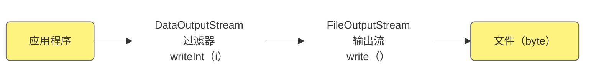
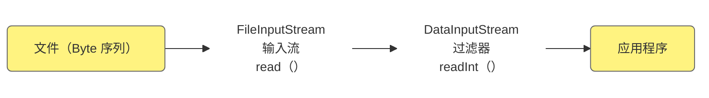
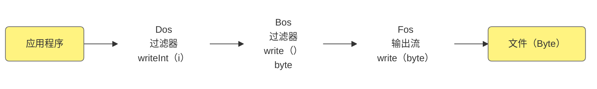
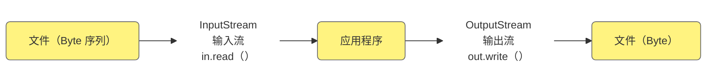

# 知识点列表

| 编号 | 名称          | 描述                                  | 级别 |
| ---- | ------------- | ------------------------------------- | ---- |
| 1    | File 类       | 操作文件 / 目录路径（不处理文件内容） | **   |
| 2    | IO 流核心概念 | 输入输出流的定义、分类及核心思想      | **   |
| 3    | 字节流        | 以字节为单位读写数据（万能流）        | **   |
| 4    | 字符流        | 以字符为单位读写数据（适合文本）      | **   |
| 5    | IO 流使用规范 | 创建→读写→关闭（资源释放）            | **   |
| 6    | 缓冲区优化    | 字节 / 字符数组提升 IO 效率           | **   |

# 文件系统（File 类）


## 1.File类的核心概念

File 类位于`java.io`包下，是对文件系统中**文件 / 目录路径**的抽象表示（而非文件内容本身）。它的核心作用是：创建 / 删除文件 / 目录、判断文件 / 目录状态、获取文件属性（大小、路径）、遍历目录文件等。

- java.io.File 用于表示文件（目录），也就是说程序员可以通过File类在程序中操作硬盘上的文件和 目录。  
- File 类只用于表示文件（目录）的信息（名称、大小等），丌能对文件的内容进行访问。 


## 2. File类的核心结构

- 核心属性：底层封装路径字符串（无公开成员变量）
- 核心方法分类：
  - 路径相关：`getPath()`（相对路径）、`getAbsolutePath()`（绝对路径）、`getName()`（文件名）
  - 创建删除：`createNewFile()`（创建文件）、`mkdir()`（单级目录）、`mkdirs()`（多级目录）、`delete()`（删除文件 / 空目录）
  - 状态判断：`exists()`（是否存在）、`isFile()`（是否文件）、`isDirectory()`（是否目录）
  - 目录遍历：`list()`（文件名数组）、`listFiles()`（File 对象数组）


## 3.File类的语法格式

### 3.1 语法格式（创建 File 对象）

```java
// 方式1：直接传入完整路径
File file1 = new File("D:/test.txt");
// 方式2：父路径 + 子路径
File file2 = new File("D:/", "test.txt");
// 方式3：父File对象 + 子路径
File parentDir = new File("D:/");
File file3 = new File(parentDir, "test.txt");
```


## 4. File类的常用操作 

### 示例1： File类的常用操作 

```java
import java.io.File;
import java.io.IOException;

public class FileDemo {
    public static void main(String[] args) {
        // 1. 指向目标文件
        File file = new File("./demo/test.txt");
        
        try {
            // 2. 判断文件是否存在，不存在则创建
            if (!file.exists()) {
                boolean isCreated = file.createNewFile();
                System.out.println("文件创建结果：" + isCreated);
            }
            
            // 3. 获取文件属性
            System.out.println("文件名称：" + file.getName());
            System.out.println("相对路径："+file.getPath());
            System.out.println("绝对路径：" + file.getAbsolutePath());
            System.out.println("文件大小（字节）：" + file.length());
            System.out.println("是否是文件：" + file.isFile());
            
            // 4. 创建多级目录
            File multiDir = new File("./demo/testDir/subDir1/subDir2");
            boolean dirCreated = multiDir.mkdirs(); // mkdirs支持多级创建
            System.out.println("多级目录创建结果：" + dirCreated);
            
        } catch (IOException e) {
            e.printStackTrace(); // 捕获文件创建异常
        }
    }
}
```

第一次运行结果：

```tex
文件创建结果：true
文件名称：test.txt
相对路径：.\demo\test.txt
绝对路径：D:\Develop\Project\javase\.\demo\test.txt
文件大小（字节）：0
是否是文件：true
多级目录创建结果：true
```


## 5.java.io.File 基本 API 

File 代表文件系统中对文件/目录的管理操作（增删改查，CRUD）

常用API方法： 

- File(String)                                     指定文件名的构造器

- long length()                                 文件的长度 

- long lastModified()  

- String getName()  

- String getPath()  

- boolean exists()  

- boolean dir.isFile()  

- boolean dir.isDirectory()  

- boolean mkdir()  

- boolean mkdirs()  

- boolean delete();  

- boolean createNewFile() throw IOException  

- File[] listFile()

### 示例1：File API 方法演示
```tex
任务:
A检查当前文件夹中是否包含目录 demo
B如果没有demo，就创建文件夹demo
C在demo 中创建文件 test.txt
D显示demo 文件夹的内容.
E显示test.txt 的绝对路径名
F显示test.txt 的文件长度和创建时间
```
```java
public class FileApiDemo{
    public static void main(String[] args) throws Exception{
        File dir = new File(".");
        //当前目录路径
        System.out.println("当前目录路径："+dir.getAbsolutePath());
        //A
        File demoDir = new File(dir,"demo");
        if(!demoDir.exists()){
            //B
            demoDir.mkdir();
        }
        //C
        File testTxt = new File(demoDir,"test.txt");
        if(!testTxt.exists()){
            testTxt.createNewFile();
        }
        //D
        File[] files = demoDir.listFiles();
        System.out.println("demo文件夹下内容："+ Arrays.toString(files));
        //E
        String testPath = testTxt.getAbsolutePath();
        System.out.println("test.txt的绝对路径："+testPath);
        //F
        System.out.println("test.txt的长度"+testTxt.length());
        System.out.println("test.txt的创建时间"+new Date(testTxt.lastModified()));
        //删除文件和目录
        testTxt.delete();
        demoDir.delete();
    }
}
```


## 6.回调模式和FileFilter 

FileFilter 类是对操作文件的过滤，相当于命令：ls|grep patten 

API方法：File[] listFile(FileFilter)

### 示例1:列出指定目录下所有的.java文件 

```任务：
有条件列目录
列出指定目录的.java文件
如：列出 src/corejava/day07 中的.java文件
```

FileFilterDemo:

```java
public class FileFilterDemo {
    public static void main(String[] args) {
        File dir = new File("./src/main/java/com/itheima/chapter20_file_io_stream");
        File[] files =dir.listFiles(new FileFilter() {
            @Override
            public boolean accept(File afile) {
                //测试：打印目录下所有内容
                System.out.println(afile.getName());
                //如果是.java后缀并且是文件则返回
                return afile.getName().endsWith(".java")&&afile.isFile();
            }
        });

        /*File[] files =dir.listFiles(afile -> {
            //测试：打印目录下所有内容
            System.out.println(afile.getName());
            //如果是.java后缀并且是文件则返回
            return afile.getName().endsWith(".java")&&afile.isFile();
        });*/

        //2.1 foreach方式输出
        for (File file:files) {
            System.out.println(file.getName());
        }

    }
}
```

注： 

- **listFiles()**方法会将dir 中每个文件交给**accept()**方法检测，如果返回true，就作为方法的返 回结果元素 

- **增强循环（for each循环）**：JDK5提供的简化版for循环 
  -  实现原理基本相同，表现形式更简洁  

- **回调模式**  
  - accept()方法的调用属于回调模式


## 7.RandomAccessFile 

**RandomAccessFile** 类是Java 提供的功能丰富的文件内容访问类，它提供了众多方法来访问文件内容，既可以**读取文件内容**，也可以**向文件输出数据**，RandomAccessFile支持“随机访问”方式，可 以访问文件的任意位置。 

1) Java 文件模型 

   在硬盘上文件是byte by byte存储的，是数据的集合 

2) 打开文件 

   有两种模式 "rw"（读写）、"r"（只读）  
   `RandomAccessFile raf = new RandomAccessFile(file, "rw");`  
   打开文件时候默认文件指针在开头 pointer=0 

3) 写入方法 

   `raf.write(int)`可以将整数的“低八位”写入到文件中，同时指针自劢移劢到下一个位置, 准备再次写入  

   - 注意：文件名的扩展名要明确指定, 没有默认扩展名现象！  

     `RandomAccessFile raf = new RandomAccessFile("Hello.java", "rw"); `

4) 读取文件

   `int b = raf.read() `从文件中读取一个byte(8位) 填充到int的低八位, 高24位为0, 返回值 范围正数: 0~255, 如果返回-1表示读取到了文件末尾! 每次读取后自劢移劢文件指针, 准备 下次读取。 

5) 文件读写完成以后一定关闭文件 

   Sun官方说明，如果不关闭，可能遇到一些意想不到的错误，根据具体操作平台不同会有不同。 在使用过程中，切忌文件读写完成后要关闭文件。 

### 7.1 写入方法

#### 示例1:RandomAccessFile 演示_写入文件 

```tex
/**	随机文件读写演示
*	任务:
*	A在demo文件夹中创建raf.dat
*	B打开这个文件,进行随机读写
*	C写人'A'和'B
*	D写入整数 0x7fffffff(int类型最大值)
*	E写入GBK 编码的'中'，d6d0
*	F一次性读取文件内容
*
*	文件模型：
*	data(下标)
*	index(下标)
*	pointer(游标)
*/
```


```java
public class RAFWriteDemo {
    public static void main(String[] args) throws IOException {
        //创建目录
        File demo = new File("./demo");
        if(!demo.exists()){
            demo.mkdir();
        }
        //A
        File file = new File(demo,"raf.dat");
        if(!file.exists()){
            file.createNewFile();
        }
        //B
        RandomAccessFile raf=new RandomAccessFile(file,"rw");
        //输出默认游标位置
        System.out.println("默认游标位置："+raf.getFilePointer());//0
        //C
        raf.write('A');
        System.out.println("输入A后的游标位置："+raf.getFilePointer());//0
        raf.write('B');

        //D
        int i = 0x7fffffff;
        raf.writeInt(i);
        //E
        String s = "中";
        byte[] gbk = s.getBytes("GBK");
        raf.write(gbk);
        System.out.println(raf.length());//8

        //移动游标到头部
        raf.seek(0);
        //F
        byte[] buf = new byte[(int)raf.length()];
        raf.read();//F-1
        System.out.println(Arrays.toString(buf));//F-2
        for (byte b:buf) {//F-3
            System.out.println(Integer.toHexString(b&0xff)+" ");
        }
        //关闭
        raf.close();
    }
}
```

注：  

- raf.write( 'A' )的**写入过程**：  

  首先，字符A在内存中是16位无符号整数0000 0000 0000 0041  

  其次，自劢类型转换，转为int类型0000 0000 0000 0000 0000 0000 0000 0041  

  最后，截取高8位，将低8位的数据写入“**流**”中 0000 0041


###  7.2 读取文件 

#### 示例2:RandomAccessFile 演示_读取文件 

```tex
/**文件读取操作
*	任务:
*	A 只读打开文件，移动到int数据位置
*	B连续读取4个byte，拼接为int(反序列化)
*
*	文件模型:
*	data    : 41 42 7f ff ff ff d6 d0 ...
*	index   : 0  1  2  3  4  5  6  7  8
*	pointer :       ^
```


```java
public class RAFReadDemo {
    public static void main(String[] args) throws IOException {
        // A 只读打开文件
        RandomAccessFile raf = new RandomAccessFile("./demo/raf.dat","r");
        int i = 0;
        raf.seek(2);

        int b=raf.read();//7f
        System.out.println(raf.getFilePointer());//3
        i=i|(b<<24);
        b=raf.read();
        i=i|(b<<16);
        b=raf.read();
        i=i|(b<<8);
        b=raf.read();
        i=i|b;//拼接
        System.out.println(Integer.toHexString(i));

        raf.seek(2);
        i=raf.readInt();
        System.out.println(Integer.toHexString(i));
        
        raf.close();
    }
}
```


# IO 流（输入 / 输出流）


## 1.IO 流的核心概念

IO（Input/Output）流是 Java 实现**数据读写**的核心机制，以 “流式传输” 的方式将数据从一个位置传输到另一个位置：

- 输入流（Input）：从外部数据源（文件 / 网络 / 键盘）读取数据到程序

- 输出流（Output）：将程序数据写入外部目的地（文件 / 网络 / 控制台）

- 核心分类：

  | 分类维度 | 类型   | 核心基类                 | 适用场景                       |
  | -------- | ------ | ------------------------ | ------------------------------ |
  | 数据单位 | 字节流 | InputStream/OutputStream | 任意文件（文本 / 图片 / 视频） |
  | 数据单位 | 字符流 | Reader/Writer            | 仅文本文件（.txt/.java）       |

- 核心区别：字符流基于字节流 + 编码表（如 UTF-8），可避免文本文件中文乱码；字节流是 “万能流”，适配所有文件类型。


## 2. 字节流

### 2.1 核心节点流（直接操作文件）

| 类名             | 作用               |
| ---------------- | ------------------ |
| FileInputStream  | 从文件读取字节数据 |
| FileOutputStream | 向文件写入字节数据 |

- 文件输入流 FileInputStream 继承了InputStream，FileInputStream 具体实现了在文件上读取
数据。 

- 文件输出流 FileOutputStream 继承了OutputStream， FileOutputStream 实现了向文件中写 出byte 数据的方法。 

### 2.2 语法格式

```java
// 字节输入流（读取）
FileInputStream fis = new FileInputStream("文件路径");
int read(); // 读1个字节，末尾返回-1
int read(byte[] b); // 读字节到数组，返回读取长度
fis.close(); // 必须关闭释放资源

// 字节输出流（写入）
// append=true：追加写入；默认false：覆盖写入
FileOutputStream fos = new FileOutputStream("文件路径", true);
fos.write(int b); // 写1个字节
fos.write(byte[] b); // 写字节数组
fos.close();
```


### 2.3 简单的示例（字节流复制文件）

#### 示例1:字节流复制文件

描述：复制source.txt内容到target_byte.txt

```java
import java.io.FileInputStream;
import java.io.FileOutputStream;
import java.io.IOException;

public class ByteStreamDemo {
    public static void main(String[] args) {
        String src = "D:/source.txt";
        String dest = "D:/target_byte.txt";
        
        FileInputStream fis = null;
        FileOutputStream fos = null;
        
        try {
            // 1. 创建流对象
            fis = new FileInputStream(src);
            fos = new FileOutputStream(dest, true);
            
            // 2. 缓冲区读写（1KB缓冲区提升效率）
            byte[] buffer = new byte[1024];
            int len; // 记录每次读取的有效字节数
            while ((len = fis.read(buffer)) != -1) {
                fos.write(buffer, 0, len); // 只写有效字节
            }
            System.out.println("字节流复制完成！");
            
        } catch (IOException e) {
            e.printStackTrace();
        } finally {
            // 3. 关闭流（先关输出，后关输入）
            try {
                if (fos != null) fos.close();
                if (fis != null) fis.close();
            } catch (IOException e) {
                e.printStackTrace();
            }
        }
    }
}
```


### 2.4 FileInputStream(文件输入流)

文件输入流 `FileInputStream` 继承了`InputStream`，`FileInputStream` 具体实现了在文件上读取
数据。 


#### 示例1：实现printHex()方法

描述：读取文件并且按照HEX输出, 每10 byte为一行。 

1) **版本01**   
   - 自定义IO工具类，printHex（String fileName）方法实现功能：**读取指定文件内容，按照 16 进制输出到控制台**  

2) **版本02**   
   - printHex（String fileName）方法中添加业务逡辑：**单位数前边补0，如8->08**  
   - 定义printHex（String fileName）的 **重载方法**：printHex（File file）和 printHex(InputStream  in)  

3) **版本03**  
   - printHex（String fileName）方法中添加业务逡辑：**每输出10byte，则换行** 

 IOUtils:

```java
public class IOUtils {
    public static void main(String[] args) throws IOException {
        printHex("./demo/raf.dat");//41 42 7F FF FF FF D6 D0 
    }

    /**
     * 读取文件并按16进制输出，每10byte为一行
     * @author zzl
     * @date 2025-12-07 23:27
     * @param fileName 文件路径
     * @throws IOException 文件读取异常
     */
    public static void printHex(String fileName) throws IOException {
        // 使用try-with-resources自动关闭流（Java 7+特性），避免资源泄漏
        try (FileInputStream in = new FileInputStream(fileName)) {
            int b;          // 存储每次读取的字节（read()返回0-255的int）
            int count = 0;  // 统计每行输出的字节数，用于控制换行

            // 替换if为while，实现循环读取整个文件
            while ((b = in.read()) != -1) {
                // 确保单字节的16进制数前面补0（如8 -> 08）
                if (b <= 0xf) {
                    System.out.print("0");
                }
                // 转换为16进制并输出，转大写提升可读性
                System.out.print(Integer.toHexString(b).toUpperCase() + " ");

                count++;
                // 每10个字节换行，并重置计数器
                if (count % 10 == 0) {
                    System.out.println();
                    count = 0;
                }
            }
            // 处理最后一行不足10个字节的情况，补充换行
            if (count != 0) {
                System.out.println();
            }
        }
    }
}
```

 IOUtils_02:

```java
public class IOUtils {
    public static void main(String[] args) throws IOException {
        /*//printHex(String fileName)
        printHex("./demo/raf.dat");//41 42 7F FF FF FF D6 D0*/

        //printHex(InputStream in)
        FileInputStream in = new FileInputStream("./demo/raf.dat");
        printHex(in);//41 42 7F FF FF FF D6 D0
    }


    /**
     * 读取文件并按16进制输出，每10byte为一行
     * @author zzl
     * @date 2025-12-07 23:27
     * @param fileName 文件路径
     * @throws IOException 文件读取异常
     */
    public static void printHex(String fileName) throws IOException {
        // 使用try-with-resources自动关闭流（Java 7+特性），避免资源泄漏
        try (FileInputStream in = new FileInputStream(fileName)) {
            int b;          // 存储每次读取的字节（read()返回0-255的int）
            int count = 0;  // 统计每行输出的字节数，用于控制换行

            // 替换if为while，实现循环读取整个文件
            while ((b = in.read()) != -1) {
                // 确保单字节的16进制数前面补0（如8 -> 08）
                if (b <= 0xf) {
                    System.out.print("0");
                }
                // 转换为16进制并输出，转大写提升可读性
                System.out.print(Integer.toHexString(b).toUpperCase() + " ");

                count++;
                // 每10个字节换行，并重置计数器
                if (count % 10 == 0) {
                    System.out.println();
                    count = 0;
                }
            }
            // 处理最后一行不足10个字节的情况，补充换行
            if (count != 0) {
                System.out.println();
            }
        }
    }


    /**
     * printHex(String fileName)的重载
     * @author zzl
     * @date 2025-12-07 23:38
     * @param in 文件输入流
     */
    public static void printHex(InputStream in) throws IOException {
        int b;
        while ((b = in.read()) != -1) {
            if (b <= 0xf) {
                System.out.print("0");
            }
            System.out.print(Integer.toHexString(b).toUpperCase() + " ");
        }
        in.close();
    }

}
```

 IOUtils_03:

```java

```


#### 示例2：实现读取文件内容的方法和重载方法

描述：IO工具类中增加读取文件内容的方法**read(String filename)**及重载方法**read(File file)**，该方法 适用于读取小文件。 

 IOUtils_04:

```java
public class IOUtils {
    public static void main(String[] args) throws IOException {

        /*//printHex(String fileName)
        printHex("./demo/raf.dat");//41 42 7F FF FF FF D6 D0*/

        /*//printHex(InputStream in)
        FileInputStream in = new FileInputStream("./demo/raf.dat");
        printHex(in);//41 42 7F FF FF FF D6 D0*/

        //read(String fileName)
        byte[] bytes=read("./demo/raf.dat");
        System.out.println(Arrays.toString(bytes));//[65, 66, 127, -1, -1, -1, -42, -48]


    }


    /**
     * 读取文件并按16进制输出，每10byte为一行
     * @author zzl
     * @date 2025-12-07 23:27
     * @param fileName 文件路径
     * @throws IOException 文件读取异常
     */
    public static void printHex(String fileName) throws IOException {
        // 使用try-with-resources自动关闭流（Java 7+特性），避免资源泄漏
        try (FileInputStream in = new FileInputStream(fileName)) {
            int b;          // 存储每次读取的字节（read()返回0-255的int）
            int count = 0;  // 统计每行输出的字节数，用于控制换行

            // 替换if为while，实现循环读取整个文件
            while ((b = in.read()) != -1) {
                // 确保单字节的16进制数前面补0（如8 -> 08）
                if (b <= 0xf) {
                    System.out.print("0");
                }
                // 转换为16进制并输出，转大写提升可读性
                System.out.print(Integer.toHexString(b).toUpperCase() + " ");

                count++;
                // 每10个字节换行，并重置计数器
                if (count % 10 == 0) {
                    System.out.println();
                    count = 0;
                }
            }
            // 处理最后一行不足10个字节的情况，补充换行
            if (count != 0) {
                System.out.println();
            }
        }
    }


    /**
     * printHex(String fileName)的重载
     * @author zzl
     * @date 2025-12-07 23:38
     * @param in 文件输入流
     */
    public static void printHex(InputStream in) throws IOException {
        int b;
        while ((b = in.read()) != -1) {
            if (b <= 0xf) {
                System.out.print("0");
            }
            System.out.print(Integer.toHexString(b).toUpperCase() + " ");
        }
        in.close();
    }

    /**
     * 读取文件到byte数组，适用于小文件
     * @author zzl
     * @date 2025-12-07 23:52
     * @param fileName
     * @return byte[]
     */
    public static byte[] read(String fileName) throws IOException{
        File file=new File(fileName);
        //1.创建等长于文件长度的byte数组
        byte[] buf=new byte[(int)file.length()];
        //2.打开文件
        FileInputStream in=new FileInputStream(file);
        //3读取文件
        int size=in.read(buf);//一次全部读取,size是读取的数量
        in.close();
        return buf;
    }

    /**
     * read(String fileName)的重载
     * @author zzl
     * @date 2025-12-08 00:03
     * @param file
     * @return byte[]
     */
    public static byte[] read(File file) throws IOException{
        //1.创建等长于文件长度的byte数组
        byte[] buf = new byte[(int) file.length()];
        //2.打开文件
        FileInputStream in=new FileInputStream(file);
        //3读取文件
        int size=in.read(buf);//一次全部读取,size是读取的数量
        in.close();
        return buf;
    }

}
```


### 2.3 FileOutputStream （文件输出流）

文件输出流 FileOutputStream 继承了OutputStream， FileOutputStream 实现了向文件中写 出byte 数据的方法。 


#### 示例1：文件输出流演示

描述 ： 

1) 版本01   
   - 完成任务  
   - A 在demo文件夹中创建out.dat  
   - B 打开这个文件  
   - C 写入 'A' 和 'B'  
   - D 写入整数 -3， 占用4个byte  
   - E 写入GBK 编码的 “中国”, D6 D0 B9 FA 
2) 版本02  
   - 演示out.wirte(byte[] b  ,  int off ,  int len )方法  
   - 注意，out.flash()方法表示清理缓存，在写代码中尽量加上，能保障可靠写

FileOutDemo_01:

```java
public class FileOutDemo {
    public static void main(String[] args) throws IOException {
        FileOutDemo01();//41 42 FF FF FF FD D6 D0 B9 FA 
    }

    public static void FileOutDemo01() throws IOException {
        //A
        File file=new File("./demo/out.dat");
        if(!file.exists()){
            file.createNewFile();
        }
        //B
        FileOutputStream out=new FileOutputStream(file);

        //C
        out.write('A');
        out.write('B');

        //D
        int a=-3;//0xfffffffd
        out.write(a>>>24);//写出a的 ff
        out.write(a>>>16);//写出a的 ff
        out.write(a>>>8);//写出a的  ff
        out.write(a);       //写出a的  fa


        byte[] gbk="中国".getBytes("GBK");
        out.write(gbk);
        out.close();
        IOUtils.printHex("./demo/out.dat");
    }
}
```

FileOutDemo_02:

```java
public class FileOutDemo {
    public static void main(String[] args) throws IOException {
        //FileOutDemo01();//41 42 FF FF FF FD D6 D0 B9 FA
        FileOutDemo02();//D6 D0
    }

    public static void FileOutDemo01() throws IOException {
        //A
        File file=new File("./demo/out.dat");
        if(!file.exists()){
            file.createNewFile();
        }
        //B
        FileOutputStream out=new FileOutputStream(file);

        //C
        out.write('A');
        out.write('B');

        //D
        int a=-3;//0xfffffffd
        out.write(a>>>24);//写出a的 ff
        out.write(a>>>16);//写出a的 ff
        out.write(a>>>8);//写出a的  ff
        out.write(a);       //写出a的  fa


        byte[] gbk="中国".getBytes("GBK");
        out.write(gbk);
        out.close();
        IOUtils.printHex("./demo/out.dat");
    }

    /**
     * 文件输出流演示 版本02
     * @author zzl
     * @date 2025-12-08 00:24 
     */
    public static void FileOutDemo02() throws IOException {
        FileOutputStream out=new FileOutputStream("./demo/out.dat");
        byte[] gbk="中国".getBytes("GBK");
        //写出byte缓冲区的部分内容(前2个)
        out.write(gbk,0,2);
        out.flush();//清理缓冲区
        out.close();//先flush，再close
        IOUtils.printHex("./demo/out.dat");//D6 D0
    }
}
```


### 2.4 DataOutputStream

DataOutputStream 和 DataInputStream 是对”流“功能的扩展，可以更方便的读取int、long、 字符等类型数据。

1. `DataOutputStream`：继承自 `OutputStream`，是**字节输出流**（用于以特定格式写入基本数据类型）；
2. `DataInputStream`：继承自 `InputStream`，是**字节输入流**（用于以特定格式读取基本数据类型）；

 

DataOutputStream 对基本的输出流功能扩展, 提供了基本数据类型的输出方法, 也就是基本类型 是序列化方法： 

- writeInt()    
- writeDouble()   
- writeUTF()

DataOutputStream 可以被理解为“过滤器”  



#### 示例1：DataOutputStream 演示

```
输出 int 5
输出 -5
输出 long -5
...
```


```java
public class DataOutDemo {
    public static void main(String[] args) throws IOException {
        String file = "./demo/dos.dat";
        FileOutputStream fos = new FileOutputStream(file);
        DataOutputStream out = new DataOutputStream(fos);

        out.writeInt(5);//00 00 00 05
        out.writeInt(-5);//FF FF FF FB
        out.writeLong(-5L);//FF FF FF FF FF FF FF FB
        out.writeDouble(5.0);//40 14 00 00 00 00 00 00 00

        out.writeUTF("中国");//E4 B8 AD E5 9B BD

        out.writeChars("中国");//4E 2D 56 FD

        out.close();
        IOUtils.printHex(file);

    }
}
```

结果：

```tex
00 00 00 05 FF FF FF FB FF FF 
FF FF FF FF FF FB 40 14 00 00 
00 00 00 00 00 06 E4 B8 AD E5 
9B BD 4E 2D 56 FD 
```


### 2.5 DataInputStream 

DataInputStream是对基本输入流（InputStream）功能的扩展，它提供基本类型的输入方法, 就 是基本类型的反序列化。  DataInputStream 是过滤器，只是功能扩展，丌能直接读取文件。

DataInputStream提供的方法有 :

- readInt()   
- readDouble()  




#### 示例1：DataInputStream  演示

DataInputStreamDemo:

```java
```


#### 示例2：将洗好的一副扑克牌写入文件，再读出来

DataInputStreamDemo:

```java

```


Card:

```java
```


IOUtils：

```java
```


CardIODemo:

```java
```


### 2.6 BufferedInputStream &&  BufferedOutputStream  

BufferedInputStream && BufferedOutputStream 为 IO操作提供了缓冲区，一般打开文件进行 写入戒读取操作时，都加上缓冲流，这种流模式是为了提高IO（输入输出）的性能。



如图所示，我们想从应用程序中把数据放入文件，相当于将一缸水倒入另一个缸中： 

- 仅使用FOS的write()方法，相当于一滴水一滴水的”转移“  
- 使用DOS的writeXxx()方法方便些，相当于一瓢一瓢的”转移“  
- 使用BOS的writeXxx()方法更方便，相当于从DOS一瓢一瓢放入桶（BOS）中，再从桶（BOS） 中倒入另一个缸，性能提高了 


##### 示例1：将洗好的一副扑克牌写入文件，再读出来

CardsIODemo：

````java

````


### 2.7 文件复制实现与优化




#### 示例1：工具类IOUtils增加文件拷贝功能

描述：

- 版本01   效率低，实现小文件的拷贝功能，拷贝大文件时会非常慢  
- 版本02  效率稍高，可拷贝大文件，拷贝文件时使用了“缓冲流”  
- 版本03（常用写法）  效率最高，可拷贝大文件，使用了byte[]数组作为一个“缓冲区”

IOUtils01：

```java
```

CopyDemo:

```java
```


IOUtils02：

```java

```

IOUtils03：

```java

```


### 2.8 字符串的序列化（文字的编码方案）

1) Stirng 字符串本质上是char[] 
   - 将char[] 转换成byte序列，就是字符串的编码, 就是字符串的序列化问题 
   - char类型是16位无符号整数, 值是unicode编码

2) **UTF-16BE** 编码方案 

   - UTF-16BE编码方案，是将16位char从中间切开为2个byte

   - UTF-16BE是将unicode编码的char[] 序列化为byte[] 的编码方案 

     如：char[] = ['A','B','中']   

     ​        byte[] = [00, 41, 00, 42, 4e, 2d] 

   - UTF-16BE编码能够支持65535个字符编码  

3) **UTF-8** 编码方案  

   - 采用变长编码 1~N方案, 其中英文占1个byte，中文占3个byte 

4) 较常用的编码 

   - **GBK**                中国国标，支持20000+中日英韩字符，英文1位编码，中文2位 
     - 不Unicode编码丌兼容，需要码表转换
     - GB2312 简体中文编码 
   - **ISO8859-1**     西欧常用字符
   - **UTF-8**             Unicode 的一种边长字符编码，又称“万国码” 


#### 示例1：编码方案演示 

描述：输出“ABC中”，比较采用丌同编码UTF-16BE、UTF-8、GBK输出的结果

IOUtils：

```java

```

EncodingDemo:

```java
```


#### 示例2：写入文本和读取文本的编码问题

BasicCharDemo:

```java
```


### 2.9 认识文本和文本文件 

1) java 的**文本**（char）是16位无符号整数，是字符的unicode编码
2) 文件是byte by byte ... 的数据序列
3) **文本文件**是文本（char）序列按照某种编码方案（utf-8, utf-16be, gbk）序列化为byte的存 储结果


## 3. 字符流


#### 3.1 核心节点流

| 类名       | 作用               |
| ---------- | ------------------ |
| FileReader | 从文件读取字符数据 |
| FileWriter | 向文件写入字符数据 |


#### 3.2 语法格式

```java
// 字符输入流（读取）
FileReader fr = new FileReader("文件路径");
int read(); // 读1个字符，末尾返回-1
int read(char[] cbuf); // 读字符到数组
fr.close();

// 字符输出流（写入）
FileWriter fw = new FileWriter("文件路径", true);
fw.write(String str); // 直接写字符串（字符流特有）
fw.flush(); // 刷新缓冲区（避免数据滞留）
fw.close(); // close会自动flush
```


#### 3.3 简单的示例（字符流读写文本）

#### 示例1：字符流读写文本

```java
import java.io.FileReader;
import java.io.FileWriter;
import java.io.IOException;

public class CharStreamDemo {
    public static void main(String[] args) {
        String src = "D:/source.txt"; // 内容：你好 字符流！Hello Char Stream!
        String dest = "D:/target_char.txt";
        
        FileReader fr = null;
        FileWriter fw = null;
        
        try {
            // 1. 创建字符流对象
            fr = new FileReader(src);
            fw = new FileWriter(dest);
            
            // 2. 字符数组缓冲区读写
            char[] cBuffer = new char[1024];
            int len;
            while ((len = fr.read(cBuffer)) != -1) {
                fw.write(cBuffer, 0, len);
                fw.flush(); // 手动刷新确保写入
            }
            System.out.println("字符流读写完成！");
            
        } catch (IOException e) {
            e.printStackTrace();
        } finally {
            // 3. 关闭流
            try {
                if (fw != null) fw.close();
                if (fr != null) fr.close();
            } catch (IOException e) {
                e.printStackTrace();
            }
        }
    }
}
```

**运行结果**：`target_char.txt`完整复制源文件内容，中文无乱码（字符流自动处理编码）。


### 3.4 其它示例

#### 示例1：Reader Writer演示

ReaderWriterDemo:

```java
```


#### 示例2：统计小说的字符 

CharCountDemo:

```java
```


### 3.5 BufferedReader（字符流的过滤器）

#### 示例1：读取文本文件（标准文本文件读取方式） 

TextFileReadDemo:

```java
```


### 3.5 PrintWriter（字符流的过滤器）

#### 示例1：写一个文本文件 

TextWriterDemo:

```java
```


## 4.序列化与基本类型序列化


## 4.1 序列化与反序列化的核心概念

### 4.1.1 序列化（Serialization）

把 Java 对象转换为**字节序列**的过程，目的是让对象可以脱离 JVM 内存，持久化存储（比如存到文件）或在网络中传输。

### 4.1.2 反序列化（Deserialization）

把字节序列恢复为 Java 对象的过程，是序列化的逆操作。

### 4.1.3 核心作用

- 持久化：将对象保存到文件、数据库等介质中；
- 网络传输：在分布式系统中（如 RPC、Socket 通信）传输对象。


1) 将类型int 转换为4 byte，或将其它数据类型（如long -> 8 byte）的过程，即将数据转换 为 n个byte序列叫**序列化**（数据 -> n byte）   

   如: 0x7fffffff  ->  [ 7f ，ff， ff， ff ]  

2) **反序列化**，将n byte 转换为一个数据的过程（n byte -> 数据） 

    如: [ 7f ，ff， ff， ff ]  -> 0x7fffffff 

3) RandomAccessFile 提供基本类型的读写方法，可以将基本类型数据序列化到文件或者将文 件内容反序列化为数据


## 4.2 对象的序列化

### 4.2.1 关键接口：Serializable

Java 中实现序列化的核心是让类实现 `java.io.Serializable` 接口，这个接口是**标记接口**（没有任何方法），仅用于告诉 JVM：这个类的对象可以被序列化。

### 4.2.2 序列化版本号：serialVersionUID

- 作用：保证序列化和反序列化时类的版本一致性，避免因类结构微调（如加字段）导致反序列化失败；
- 生成方式：可以手动指定（推荐），也可以由 JVM 自动生成（不推荐，类结构变化会导致版本号改变）。

### 4.2.3 序列化规则

- 被 transient 修饰的字段**不会被序列化**；
- 静态字段（static）不会被序列化（静态字段属于类，而非对象）；
- 父类实现 Serializable，子类自动可序列化；子类实现但父类未实现，父类的字段不会被序列化。


## 4.3 序列化与反序列化示例

### 案例 1:序列化与反序列化

#### 步骤 1：定义可序列化的实体类

```java
import java.io.Serializable;

// 实现Serializable接口，标记该类可序列化
public class User implements Serializable {
    // 手动指定序列化版本号（推荐）
    private static final long serialVersionUID = 1L;
    
    private String username;
    private int age;
    // transient修饰的字段不参与序列化
    private transient String password;

    // 构造方法
    public User(String username, int age, String password) {
        this.username = username;
        this.age = age;
        this.password = password;
    }

    // getter/setter（省略，实际使用需补充）
    @Override
    public String toString() {
        return "User{" +
                "username='" + username + '\'' +
                ", age=" + age +
                ", password='" + password + '\'' +
                '}';
    }
}
```

#### 步骤 2：序列化与反序列化工具类

```java
import java.io.*;

public class SerializationUtil {
    // 序列化：将对象写入文件
    public static void serialize(Object obj, String filePath) throws IOException {
        try (ObjectOutputStream oos = new ObjectOutputStream(new FileOutputStream(filePath))) {
            oos.writeObject(obj);
            System.out.println("序列化完成！");
        }
    }

    // 反序列化：从文件读取对象
    public static Object deserialize(String filePath) throws IOException, ClassNotFoundException {
        try (ObjectInputStream ois = new ObjectInputStream(new FileInputStream(filePath))) {
            Object obj = ois.readObject();
            System.out.println("反序列化完成！");
            return obj;
        }
    }

    // 测试方法
    public static void main(String[] args) {
        String filePath = "user.ser";
        // 1. 创建对象
        User user = new User("张三", 20, "123456");
        System.out.println("序列化前：" + user);

        try {
            // 2. 序列化
            serialize(user, filePath);
            // 3. 反序列化
            User deserializedUser = (User) deserialize(filePath);
            System.out.println("反序列化后：" + deserializedUser);
        } catch (IOException | ClassNotFoundException e) {
            e.printStackTrace();
        }
    }
}
```


**运行结果：**

```tex
序列化前：User{username='张三', age=20, password='123456'}
序列化完成！
反序列化完成！
反序列化后：User{username='张三', age=20, password='null'}
```

**结果分析：**password 被 transient 修饰，未被序列化，反序列化后为 null。


### 示例2：对象序列化和反序列化演示


### 示例3：对象序列化和反序列化演示


## 4.4 浅层复制与深层复制


## 4.5 流的过滤器


# File 类与IO流的核心总结

1. File 类仅抽象表示文件 / 目录路径，可操作路径属性但无法读写文件内容，核心方法包括创建、删除、判断状态等。
2. IO 流分为字节流（万能流，适配所有文件）和字符流（仅文本，处理编码），核心使用步骤是 “创建流→缓冲区读写→关闭流”。
3. 缓冲区（字节 / 字符数组）能大幅提升 IO 效率，字节流复制文件时建议使用 8KB 左右的缓冲区大小。


# 实践

## 1.通用文件复制工具

```java
import java.io.FileInputStream;
import java.io.FileOutputStream;
import java.io.IOException;

// 支持所有文件类型的复制工具（字节流实现）
public class FileCopyUtil {
    public static void main(String[] args) {
        // 测试：复制图片文件
        copyFile("D:/test.jpg", "D:/copy_test.jpg");
    }
    
    /**
     * 文件复制方法
     * @param srcPath 源文件路径
     * @param destPath 目标文件路径
     */
    public static void copyFile(String srcPath, String destPath) {
        FileInputStream fis = null;
        FileOutputStream fos = null;
        
        try {
            fis = new FileInputStream(srcPath);
            fos = new FileOutputStream(destPath);
            
            // 8KB缓冲区（最优大小之一）
            byte[] buffer = new byte[8192];
            int len;
            long start = System.currentTimeMillis();
            
            while ((len = fis.read(buffer)) != -1) {
                fos.write(buffer, 0, len);
            }
            
            long end = System.currentTimeMillis();
            System.out.println("复制完成！耗时：" + (end - start) + "ms");
            
        } catch (IOException e) {
            System.out.println("复制失败：" + e.getMessage());
        } finally {
            try {
                if (fos != null) fos.close();
                if (fis != null) fis.close();
            } catch (IOException e) {
                e.printStackTrace();
            }
        }
    }
}
```

