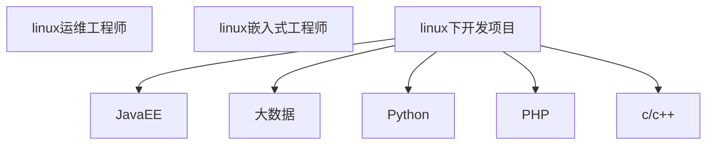
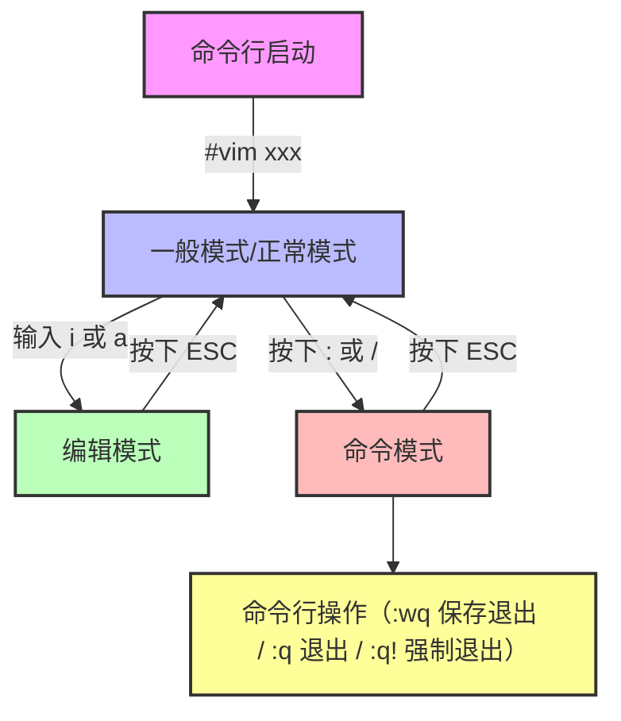

# 尚硅谷 Linux 课程（大数据、JavaEE、Python 通用版）


# 第 1 章 Linux 开山篇

## 1.1 本套 Linux 课程的内容介绍

本课程为大数据、JavaEE、Python 开发者通用版，涵盖 Linux 基础操作、系统配置、实战应用及多领域定制内容，以 “实用实战” 为核心，减少冗余理论，聚焦开发与运维中高频使用的技能。


---


## 1.2 Linux 的学习方向

### 1.2.1 Linux 运维工程师

负责 Linux 服务器的稳定运行，包括系统部署、性能优化、故障排查、安全防护等，是企业 IT 基础设施的核心维护角色。

### 1.2.2 Linux 嵌入式开发工程师

专注于将 Linux 系统适配到嵌入式设备（如机顶盒、智能硬件、物联网设备等），需掌握 Linux 内核裁剪、驱动开发等技能。

### 1.2.3 在 Linux 下做各种程序开发

基于 Linux 环境进行 JavaEE、大数据、Python 等方向的开发，需熟悉 Linux 终端操作、环境配置、服务部署等基础能力。

### 1.2.4 示意图

```plaintext
Linux学习方向分支：
- 运维方向：Linux运维工程师
- 嵌入式方向：Linux嵌入式开发工程师
- 开发方向：JavaEE开发、大数据开发、Python开发、C/C++开发等
```





## 1.3 Linux 的应用领域

### 1.3.1 个人桌面应用领域

传统 Linux 桌面因界面操作复杂、应用软件较少，长期被 Windows 压制；但近年来 Ubuntu、Fedora 等桌面发行版优化后，界面友好度提升，硬件厂商支持增加，占有率逐步提高。

### 1.3.2 服务器应用领域

Linux 在服务器领域优势显著，凭借免费、稳定、高效、高并发支持的特点，广泛应用于互联网、金融、企业级服务等场景，百度、谷歌、淘宝等平台的后台服务器均以 Linux 为核心。

### 1.3.3 嵌入式应用领域

Linux 因运行稳定、网络支持好、成本低、可裁剪（内核最小可至几百 KB），成为嵌入式设备的主流系统，应用于机顶盒、数字电视、网络电话、智能家居、智能硬件等，未来在物联网领域应用将更广泛。

## 1.4 学习 Linux 的阶段（高手进阶过程）

Linux 学习需循序渐进，建议分 6 个阶段进阶：

1. **基础操作阶段**：掌握文件操作（rm、mkdir、chmod、chown）、编辑器使用（vi/vim）、用户管理（useradd、userdel、usermod）等基础命令。
2. **系统配置阶段**：学习环境变量配置、网络配置、服务配置（如 SSH、防火墙）等。
3. **开发环境搭建阶段**：基于 Linux 搭建 JavaEE、大数据、Python 等领域的开发与运行环境。
4. **自动化运维阶段**：编写 Shell 脚本，实现服务器批量管理、日志分析、任务调度等自动化操作。
5. **安全与调优阶段**：配置系统安全策略（防火墙、权限控制）、防止攻击，对系统性能（CPU、内存、磁盘）进行调优。
6. **内核与架构阶段**：深入理解 Linux 内核原理，掌握大型网站架构部署与维护（如集群、负载均衡）。

## 1.5 Linux 的学习方法和建议

1. 以 “高效实用” 为目标，避免陷入无意义的理论钻研。
2. 先建立整体知识框架，再逐步填充细节，避免碎片化学习。
3. **无需记忆所有指令，学会通过`man`手册、百度等工具查询用法。**
4. 遵循 “先会用，再深究原理”（先 know how，再 know why），优先解决实际问题。
5. 计算机学科需 “做中学”，通过实际操作验证知识，而非单纯阅读。
6. 初期可 “囫囵吞枣”，先掌握高频操作，后续逐步深化理解。
7. Linux 核心是实操，需熟练掌握常用指令，提升终端操作效率。

# 第 2 章 基础篇 Linux 入门

## 2.1 Linux 介绍

1. **读音**：常见读音为 “里纽克斯”“利尼克斯”“里纳克斯”。
2. **定位**：免费、开源、安全、高效、稳定的操作系统，对高并发场景支持优异，广泛用于企业级项目部署。
3. **创始人**：Linus Torvalds（林纳斯・托瓦兹），1991 年发布 Linux 内核。
4. **吉祥物**：企鹅 Tux，象征友好、开源精神。
5. **主要发行版**：基于 Linux 内核衍生出多个发行版，常见包括 RedHat、CentOS、Ubuntu、SUSE、Fedora 等，其中 CentOS 因稳定、免费，是企业服务器的主流选择。
6. **主流操作系统对比**：当前主流操作系统包括 Windows、Android、Linux、车载系统等，Linux 主要用于服务器与嵌入式设备，Windows 主要用于个人桌面。

## 2.2 UNIX 是怎么来的

UNIX 起源于 20 世纪 70 年代的贝尔实验室，由 Ken Thompson 和 Dennis Ritchie 开发，最初用于小型机；80 年代后，IBM、Sun、HP 等厂商基于 UNIX 推出商业版本（如 IBM AIX、Sun Solaris、HP-UX），形成 “UNIX 生态”。UNIX 的核心理念是 “免费开源”，用户应享有阅读、修改源代码的权利，软件公司可通过服务与培训盈利（由 Richard Stallman 倡导）。

## 2.3 Linux 是怎么来的

Linux 的诞生源于 “GNU 计划”（由 Richard Stallman 发起，旨在开发免费开源的类 UNIX 系统），但 GNU 计划缺少成熟内核；1991 年，Linus Torvalds 开发出 Linux 内核，并与 GNU 的工具链（如编辑器、Shell）结合，形成完整的 GNU/Linux 系统，即现在的 Linux。

## 2.4 Linux 和 UNIX 关系一览图


```plaintext
UNIX（贝尔实验室，70年代）
├─ 商业分支：IBM AIX、Sun Solaris、HP-UX、AT&T System V
├─ 开源分支：BSD → FreeBSD
└─ 衍生系统：Minix（适用于x86个人计算机）→ Linux内核（Linus开发）
     └─ 发行版：Ubuntu、RedHat、CentOS、SUSE、Fedora
```

## 2.5 Linux 和 Windows 比较

| 比较维度   | Windows                                            | Linux                                                |
| ---------- | -------------------------------------------------- | ---------------------------------------------------- |
| 免费与收费 | 收费且价格较高                                     | 免费或仅需少量费用（如企业版 RedHat）                |
| 软件与支持 | 软件数量多、质量高，但多为收费；由微软官方提供支持 | 开源自由软件为主，可修改定制；支持来自全球开发者社区 |
| 安全性     | 需频繁打补丁，易受病毒、木马攻击                   | 安全性更高，漏洞较少，病毒风险低                     |
| 使用习惯   | 纯图形界面操作，上手简单                           | 支持图形与命令行，命令行效率高，新手入门较难         |
| 可定制性   | 封闭系统，可定制性差                               | 开源系统，可深度定制内核、界面、服务                 |
| 应用场景   | 个人桌面操作系统主流                               | 服务器、嵌入式设备、大数据集群等企业级场景           |

# 第 3 章 基础篇 VM 和 Linux 系统（CentOS）安装

## 3.1 安装 VM 和 CentOS

学习 Linux 需先搭建实验环境，步骤为：

1. 安装虚拟机软件（VMware Workstation 12）。
2. 在虚拟机中安装 CentOS 6.8 系统（推荐版本，稳定性高）。

## 3.2 VM 软件和 CentOS 的安装软件

- **VMware 下载**：官方网站或第三方可靠平台获取 VMware Workstation 12 安装包。
- **CentOS 下载**：推荐国内镜像源，速度更快：
  - 网易镜像：http://mirrors.163.com/centos/6/isos/
  - 搜狐镜像：http://mirrors.sohu.com/centos/6/isos

## 3.3 VM 安装的步骤

1. 进入电脑 BIOS，开启 “虚拟化设备支持”（快捷键通常为 F2、F10）。
2. 运行 VMware 安装包，按向导提示完成安装（默认选项即可，需注意安装路径）。

## 3.4 CentOS 安装的步骤

1. **创建虚拟机**：打开 VMware，新建虚拟机，选择 “自定义” 模式，配置内存（建议 2GB 以上）、硬盘（建议 20GB 以上）、网络连接方式（见 3.4.1）。
2. **安装系统**：加载 CentOS 6.8 镜像，启动虚拟机，按向导选择语言（中文）、分区（建议 “自定义分区”，分 /boot、swap、/ 三个分区）、设置 root 密码，等待安装完成。

### 虚拟机网络连接方式说明

| 连接方式 | 特点                                                         |
| -------- | ------------------------------------------------------------ |
| 桥连接   | Linux 可与局域网内其他设备通信，但可能导致 IP 冲突           |
| NAT      | Linux 可访问外网，通过主机 IP 转换，不会冲突，适合个人学习环境 |
| 主机模式 | Linux 仅能与主机通信，无法访问外网，适合封闭测试环境         |

## 3.5 CentOS 的终端使用和联网

1. **终端打开**：在 CentOS 桌面右键，选择 “打开终端”，进入命令行界面。
2. **联网配置**：点击桌面右上角 “网络图标”，选择 “启用 eth0”（有线网卡），系统自动获取 IP（NAT 模式下），可通过`ping www.baidu.com`验证联网状态。

## 3.6 VMtools 安装

### 3.6.1 介绍

VMtools 是 VMware 提供的工具集，主要功能：

- 实现 Windows 与 Linux 之间的命令复制粘贴。
- 设置共享文件夹，实现两系统文件互传。
- 优化虚拟机显示（如分辨率自适应）。

## 3.7 VMtools 的安装和使用

### 3.7.1 安装 vmtools 的步骤说明

1. 启动 CentOS 虚拟机，点击 VMware 菜单 “虚拟机”→“安装 VMware Tools”。
2. CentOS 桌面会出现 VMtools 安装包（.tar.gz 格式），右键解压到桌面（如`/root/桌面/vmware-tools-distrib`）。
3. 打开终端，进入解压目录：`cd /root/桌面/vmware-tools-distrib`。
4. 执行安装脚本：`./vmware-install.pl`，全程按回车选择默认配置。
5. 安装完成后，重启 CentOS：**`reboot`**，使配置生效。

### 3.7.2 使用 vmtools 设置共享文件夹

1. 点击 VMware 菜单 “虚拟机”→“设置”→“选项”→“共享文件夹”。
2. 选择 “总是启用”，点击 “添加”，选择 Windows 中的文件夹（如`D:\myshare`），完成设置。
3. 在 CentOS 中，共享文件夹路径为`/mnt/hgfs/`，进入该目录即可访问 Windows 共享的文件。

### 3.7.3 安装 vmtools 的课堂练习

1. 在 Windows 中创建`C:\myDir`文件夹，新建`hello.txt`并写入内容。
2. 按上述步骤设置该文件夹为共享文件夹。
3. 在 CentOS 中访问`/mnt/hgfs/myDir`，查看并验证`hello.txt`文件是否存在。

# 第 4 章 基础篇 Linux 的目录结构

## 4.1 基本介绍

Linux 采用**层级式树状目录结构**，所有目录均从根目录 “/” 衍生，且 “一切皆文件”（硬件设备、服务等均以文件形式管理）。理解目录结构是 Linux 操作的核心基础。

```bash
/
├─ /root
│  ├─ /root/Desktop
│  ├─ /root/Maildir
│  └─ ......
├─ /bin
├─ /boot
├─ /dev
├─ /etc
├─ /home
├─ /var
├─ /lib
├─ /usr
│  ├─ /usr/bin
│  ├─ /usr/lib
│  └─ ......
├─ /media
└─ ......
```

```bash
/  <-- 根目录，所有目录/文件的起始点，Linux唯一的根路径
├── bin/  <-- 存放所有用户可执行的**常用系统命令**（如 ls、cd、cp、rm）
│   └── （无需手动修改，系统自带核心命令）
├── sbin/  <-- 存放仅 root 权限可执行的**系统管理命令**（如 shutdown、ifconfig、fdisk）
│   └── （管理员专用，普通用户无执行权限）
├── home/  <-- 普通用户的**主目录集合**，每个用户对应一个以用户名命名的子目录
│   ├── user1/  <-- 普通用户 user1 的家目录（存放个人文件、配置）
│   └── user2/  <-- 普通用户 user2 的家目录
├── root/  <-- 超级管理员（root）的**专属家目录**，普通用户无访问权限
├── boot/  <-- 存放 Linux 启动相关文件（内核镜像、引导程序 grub）
│   ├── vmlinuz  <-- 内核文件
│   └── initrd.img  <-- 启动初始化镜像文件
├── etc/  <-- 存放**系统/应用的配置文件**（核心目录，手动修改需谨慎）
│   ├── profile  <-- 系统环境变量配置
│   ├── passwd  <-- 用户账号信息配置
│   ├── ssh/  <-- SSH 服务配置目录
│   └── nginx/  <-- Nginx 应用配置目录（安装后生成）
├── tmp/  <-- 系统**临时文件目录**，所有用户可读写，系统重启后内容自动清空
├── var/  <-- 存放**动态变化的文件**（日志、缓存、数据库数据等）
│   ├── log/  <-- 系统/应用日志目录（如 /var/log/messages 系统日志）
│   ├── lib/  <-- 数据库、缓存等持久化数据
│   └── www/  <-- Web 应用的网页根目录（如 Apache/Nginx 托管文件）
├── lib/  <-- 存放系统运行依赖的**共享库文件**（类似 Windows 的 .dll 文件）
│   └── modules/  <-- 内核模块文件
├── lib64/  <-- 64 位系统专属的**共享库文件目录**
├── usr/  <-- 存放系统**预装软件、用户工具、文档**（相当于 Windows 的 Program Files）
│   ├── bin/  <-- 预装应用的执行命令（如 git、java）
│   ├── local/  <-- 手动编译安装软件的目录（如源码安装的 Nginx、MySQL）
│   └── share/  <-- 软件的帮助文档、图标等共享资源
├── dev/  <-- 设备文件目录，Linux **一切皆文件**，硬件设备以文件形式存在
│   ├── sda1/  <-- 第一块硬盘的第一个分区
│   ├── tty/  <-- 终端设备文件
│   └── null/  <-- 空设备（相当于“黑洞”，写入内容会被丢弃）
├── mnt/  <-- 手动挂载目录，用于挂载外部存储（U盘、移动硬盘、共享文件夹）
│   └── usb/  <-- 手动创建的 U 盘挂载点
├── media/  <-- 自动挂载目录，系统识别外部设备后自动挂载到此处（如 U 盘、光驱）
├── opt/  <-- 第三方大型软件的**安装目录**（如 Oracle、Tomcat 等，默认为空）
├── proc/  <-- 虚拟目录，**映射系统内存信息**，无实际磁盘存储，用于查看系统状态
│   ├── cpuinfo  <-- CPU 信息
│   ├── meminfo  <-- 内存信息
│   └── pid/  <-- 对应进程 ID 的运行信息（如 /proc/1 对应 init 进程）
├── sys/  <-- 内核硬件设备管理目录，用于查看/配置硬件参数（2.6 内核以上新增）
├── srv/  <-- 存放服务启动后需要读取的**静态数据**（如 Web 服务的静态资源、下载文件）
└── selinux/  <-- SELinux 安全子系统目录，用于控制程序访问权限，保障系统安全
```


## 4.2 目录结构的具体介绍

| **目录路径**                         | **功能说明**                                                 |
| ------------------------------------ | ------------------------------------------------------------ |
| **/bin**（/usr/bin、/usr/local/bin） | 存放最常用的系统命令（如 ls、cd、cp），所有用户可执行。      |
| /sbin（/usr/sbin、/usr/local/sbin）  | 存放系统管理员专用命令（如 shutdown、ifconfig），需 root 权限执行。 |
| **/home**                            | 普通用户的主目录，每个用户对应一个以用户名命名的子目录（如`/home/zhangsan`）。 |
| **/root**                            | 系统管理员（root 用户）的主目录，普通用户无访问权限。        |
| **/boot**                            | 存放 Linux 启动相关文件（内核镜像、引导程序），不可随意删除。 |
| /proc                                | 虚拟目录，映射系统内存信息，可通过该目录查看 CPU、内存、进程状态（如`/proc/cpuinfo`）。 |
| /srv                                 | 存放服务启动后需读取的数据（如 Web 服务的静态资源）。        |
| /sys                                 | 2.6 内核新增目录，存放内核相关的硬件设备信息，用于系统硬件管理。 |
| /tmp                                 | 临时文件目录，系统重启后内容清空，所有用户可读写。           |
| /dev                                 | 设备文件目录，将硬件设备以文件形式管理（如硬盘`/dev/sda`、鼠标`/dev/mouse`）。 |
| **/media**                           | 自动挂载目录，系统识别 U 盘、光驱等外部设备后，会自动挂载到该目录下。 |
| **/mnt**                             | 手动挂载目录，用户可将外部存储（如共享文件夹、额外硬盘）挂载到该目录。 |
| /opt                                 | 第三方软件安装目录（如 Oracle 数据库、大型工具），默认为空。 |
| **/usr/local**                       | **源码编译安装软件的目录**（如手动安装的 Nginx、MySQL），与系统自带软件区分。 |
| **/var**                             | 存放动态变化的文件（如日志、缓存、数据库数据），常见子目录有`/var/log`（日志）、`/var/lib`（数据库文件）。 |
| /selinux                             | SELinux 安全子系统目录，用于控制程序访问权限，保障系统安全。 |

## 4.3 Linux 目录总结

1. Linux 仅有一个根目录 “/”，所有子目录均从根目录衍生。
2. 目录功能有明确规划，不可随意存放文件（如系统命令放 /bin，临时文件放 /tmp）。
3. “一切皆文件” 是 Linux 核心思想，硬件、服务等均以文件形式管理。
4. 需熟记常用目录的功能，避免操作时误删关键文件（如 /boot、/proc 目录不可随意修改）。

# 第 5 章 实操篇远程登录 Linux 系统

## 5.1 为什么需要远程登录 Linux

### 5.1.1 示意图

```plaintext
远程登录架构：
Windows（本地）          Linux服务器（机房/云端）
├─ XShell5（远程终端）   ├─ SSHD服务（监听22端口）
└─ XFTP5（文件传输）     └─ 应用服务（如MySQL、Web服务）
```

### 5.1.2 说明

1. 企业中 Linux 服务器通常是共享资源，放置在机房或云端，开发者需远程操作。
2. 正式环境的项目部署在公网服务器，需远程登录进行管理（如代码部署、日志查看）。
3. 远程工具（如 XShell、XFTP）可实现 Windows 与 Linux 的命令交互、文件传输，是开发与运维的必备工具。

## 5.2 远程登录 Linux-XShell5

XShell 是 Windows 下的远程终端工具，支持 SSH1、SSH2 协议，特点：

- 速度流畅，支持中文编码，解决乱码问题。
- 可保存会话配置，方便快速登录多台服务器。
- 需 Linux 启用 SSHD 服务（默认监听 22 端口），否则无法连接。

## 5.3 安装 XShell5 并使用

### 5.3.1 安装过程

下载 XShell5 安装包，按向导默认安装（注意选择 “免费版” 用于个人学习）。

### 5.3.2 XShell5 的关键配置

1. 打开 XShell，点击 “文件”→“新建”，配置会话：
   - 名称：自定义（如 “CentOS-192.168.184.128”）。
   - 协议：SSH。
   - 主机：Linux 服务器的 IP 地址（如 192.168.184.128）。
   - 端口号：22（SSHD 默认端口）。
2. 点击 “用户身份验证”，输入 Linux 的用户名（如 root）和密码，保存配置。

### 5.3.3 XShell5 远程登录后的操作

登录成功后，终端显示 Linux 命令提示符（如`[root@hadoop1 ~]#`），可直接执行 Linux 命令（如 ls、cd、pwd），操作与本地终端一致。

## 5.4 远程上传下载文件 - XFTP5

### 5.4.1 XFTP5 软件介绍

XFTP 是 Windows 下的 SFTP/FTP 文件传输工具，支持加密传输，可安全实现 Windows 与 Linux 之间的文件互传。

### 5.4.2 XFTP5 软件的安装

下载 XFTP5 安装包，默认安装，与 XShell 关联（可从 XShell 直接启动）。

### 5.4.3 XFTP5 的配置和使用

1. 打开 XFTP，点击 “文件”→“新建”，配置会话：
   - 名称：自定义。
   - 协议：SFTP（安全传输，推荐）。
   - 主机：Linux 服务器 IP。
   - 端口号：22。
   - 用户名 / 密码：Linux 的登录账号。
2. 连接成功后，界面分为左右两栏：左栏为 Windows 本地目录，右栏为 Linux 远程目录，拖拽文件即可实现上传 / 下载。

### 5.4.4 解决 XFTP5 中文乱码的问题

1. 打开 XFTP 会话属性，切换到 “选项” 标签。
2. 勾选 “使用 UTF-8 编码”，点击 “确定”。
3. 刷新会话，中文文件名即可正常显示。

## 5.5 XFTP5 和 XShell5 的使用练习

1. 通过 XFTP5 将 Windows 中的`test.txt`文件上传到 Linux 的`/root`目录。
2. 通过 XShell5 登录 Linux，执行`reboot`命令重启系统，验证远程操作有效性。

# 第 6 章 实操篇 VI 和 VIM 编辑器

## 6.1 VI 和 VIM 的基本介绍

- **VI**：所有 Linux 系统默认内置的文本编辑器，功能基础，仅支持字符界面。
- **VIM**：VI 的增强版，支持语法高亮、代码补完、编译跳转等功能，更适合程序开发，是 Linux 下主流的编辑器。

## 6.2 VI 和 VIM 的三种常见模式

### 6.2.1 正常模式（默认模式）

- 启动 VIM 后默认进入该模式，无法直接输入文本。
- 功能：移动光标（上下左右键）、删除字符 / 行（dd、x）、复制粘贴（yy、p）、撤销操作（u）等。

### 6.2.2 插入模式（编辑模式）

- 进入方式：在正常模式下按`i`（光标前插入）、`a`（光标后插入）、`o`（新行插入）等键。
- 功能：输入、修改文本，按`Esc`键返回正常模式。

### 6.2.3 命令行模式

- 进入方式：在正常模式下按`:`或`/`键。
- 功能：保存文件（`:w`）、退出（`:q`）、强制退出（`:q!`）、查找（`/关键字`）、设置行号（`:set nu`）等，执行命令后自动返回正常模式。

## 6.3 快速入门案例：使用 VIM 创建 Hello.java

1. 打开终端，执行`vim Hello.java`，进入 VIM 正常模式。

2. 按`i`键进入插入模式，输入代码：

   ```java
   public class Hello {
       public static void main(String[] args) {
           System.out.println("hello, world!");
       }
   }
   ```

3. 按`Esc`返回正常模式，输入`:wq`保存并退出 VIM。

4. 执行`javac Hello.java`编译，`java Hello`运行，验证代码有效性。

```bash
# 编译Java源文件（生成Hello.class类文件）
javac Hello.java

# 运行编译后的类文件
java Hello
```

## 6.4 VI 和 VIM 三种模式的相互转化图

```plaintext
命令行模式
   ↑（按:或/）
   ↓（执行命令后）
正常模式 ←→ 插入模式
   （按i/a/o等）（按Esc）
```




## 6.5 快捷键的使用案例

| 快捷键       | 功能说明                                              |
| ------------ | ----------------------------------------------------- |
| yy           | 复制当前行；5yy 复制当前行向下 5 行                   |
| p            | 粘贴复制的内容到光标后                                |
| dd           | 删除当前行；5dd 删除当前行向下 5 行                   |
| / 关键字     | 查找关键字，按`n`查看下一个匹配，`N`查看上一个匹配    |
| :set nu      | 显示行号；:set nonu 取消行号                          |
| G            | 光标跳转到文件末尾；gg 跳转到文件开头                 |
| u            | 撤销上一步操作                                        |
| 20 + Shift+g | 先输入行号（如 20），再按 Shift+g，光标跳转到第 20 行 |


## 6.6 VIM 和 VI 的快捷键键盘一览图

（注：核心快捷键已在 6.5 中覆盖，完整键盘图可参考 Linux 系统内置的`vimtutor`教程，执行`vimtutor`即可启动）


## 6.7 VI 和 VIM 课堂练习

1. 使用 VIM 创建`Hello.java`，输入上述入门案例代码。
2. 练习快捷键：复制第 2 行（yy）、粘贴到第 5 行（p）、删除第 3 行（dd）、查找 “hello”（/hello）。
3. 保存文件并退出，无需编译（后续章节讲解 Java 环境搭建）。

# 第 7 章 实操篇开机、重启和用户登录注销

## 7.1 关机 & 重启命令

### 7.1.1 基本命令

| 命令            | 功能说明                                                     |
| --------------- | ------------------------------------------------------------ |
| shutdown -h now | 立即关机                                                     |
| shutdown -h 1   | 1 分钟后关机（可自定义时间，如 shutdown -h 20:30 表示 20:30 关机） |
| shutdown -r now | 立即重启                                                     |
| halt            | 直接关机，等价于 shutdown -h now                             |
| reboot          | 直接重启，等价于 shutdown -r now                             |
| sync            | 将内存中的数据同步到磁盘，防止关机时数据丢失（建议关机前执行） |

### 7.1.2 注意细节

- 关机 / 重启前必须执行`sync`，避免内存数据未写入磁盘导致丢失。
- 远程服务器操作时，需确认无其他用户使用，避免强制关机影响业务。

## 7.2 用户登录和注销

### 7.2.1 基本介绍

1. 登录建议：尽量使用普通用户登录，避免直接使用 root（权限过高，误操作风险大）；需管理员权限时，通过`su - 用户名`切换。
2. 注销命令：在终端执行`logout`，仅在命令行模式（运行级别 3）生效，图形界面（运行级别 5）无效。

### 7.2.2 使用细节

- 注销后，当前终端会话关闭，需重新登录。
- 若远程登录（如 XShell），注销后连接断开，需重新建立会话。

# 第 8 章 实操篇用户管理

## 8.1 基本介绍

Linux 是多用户多任务系统，任何用户使用系统前需申请账号，且每个用户至少属于一个组。用户登录后自动进入其 “家目录”（普通用户家目录在`/home/用户名`，root 家目录在`/root`）。

## 8.2 添加用户

### 8.2.1 基本语法

```bash
useradd [选项] 用户名
```

### 8.2.2 实际案例

- 案例 1：添加用户`xm`，自动创建家目录`/home/xm`：


  ```bash
  useradd xm
  ```

- 案例 2：添加用户`xq`，指定家目录为`/home/dog`：

  ```bash
  useradd -d /home/dog xq
  ```

### 8.2.3 细节说明

- 添加用户成功后，系统自动创建与用户名同名的家目录（除非通过`-d`指定）。
- 新用户默认无密码，需通过`passwd`命令设置后才能登录。

## 8.3 给用户指定或修改密码

#### 基本语法

```bash
passwd 用户名
```

#### 应用案例

- 给用户`xm`设置密码：

  ```bash
  passwd xm
  ```

  执行后按提示输入密码（输入时不显示，需谨慎输入），密码需满足复杂度（建议包含字母、数字、特殊字符，避免过短或简单）。

## 8.4 删除用户

### 8.4.1 基本语法

```bash
userdel 用户名          # 删除用户，保留家目录
userdel -r 用户名       # 删除用户及家目录
```

### 8.4.2 应用案例

- 案例 1：删除用户`xm`，保留家目录`/home/xm`：

  ```bash
userdel xm
  ```

- 案例 2：删除用户`xq`及家目录`/home/dog`：

  ```bash
  userdel -r xq
  ```


### 8.4.3 思考题

企业中通常不删除用户家目录，原因：家目录可能存放用户的配置文件、项目数据等，删除后可能导致数据丢失，后续如需恢复用户可直接复用家目录。

## 8.5 查询用户信息

### 8.5.1 基本语法

```bash
id 用户名
```

### 8.5.2 应用实例

- 案例 1：查询 root 用户信息：

  ```bash
  id root
  # 输出：uid=0(root) gid=0(root) 组=0(root)
  ```
  
- 案例 2：查询不存在的用户`xq`：

  ```bash
  id xq
  # 输出：id: xq: 无此用户
  ```
  

### 8.5.3 细节说明

- 输出结果中，`uid`为用户 ID，`gid`为用户所属主组 ID，`组`为用户所属的所有组。

## 8.6 切换用户

### 8.6.1 介绍

当当前用户权限不足时，通过`su - 用户名`切换到高权限用户（如 root），切换后环境变量同步更新。

### 8.6.2 基本语法

```bash
su - 用户名  # - 可省略
```

### 8.6.3 应用实例

- 案例：创建用户`zf`，设置密码后切换到`zf`：

  ```bash
  # 创建用户
  useradd zf
  # 设置密码
  passwd zf
  # 切换到zf
  su - zf
  # 此时提示符变为[zf@hadoop1 ~]$，表示切换成功
  ```

### 8.6.4 细节说明


- 从高权限用户切换到低权限用户（如 root→zf），无需输入密码；反之（zf→root）需输入目标用户密码。
- 切换后，执行`exit`可返回原用户。

## 8.7 用户组

### 8.7.1 介绍

用户组是用户的集合，用于对多个用户进行统一权限管理（如给组授权，组内所有用户均享有该权限）。

### 8.7.2 增加组

```bash
groupadd 组名
```

- 案例：创建组`wudang`：

  ```bash
  groupadd wudang
  ```


### 8.7.3 删除组

```bash
groupdel 组名
```

- 案例：删除组`wudang`：

  ```bash
  groupdel wudang
  ```


## 8.8 增加用户时直接加入组

### 8.8.1 基本语法

```bash
useradd -g 组名 用户名
```

### 8.8.2 案例演示

- 创建用户`zwj`，直接加入`wudang`组：

  ```bash
  # 先创建组
  groupadd wudang
  # 创建用户并指定组
  useradd -g wudang zwj
  # 验证：id zwj 输出 gid=503(wudang)
## 8.9 修改用户的组

### 8.9.1 基本语法

```bash
usermod -g 新组名 用户名
```

### 8.9.2 案例演示

- 将用户`zwj`从`wudang`组修改到`shaolin`组：

  ```bash
  # 先创建新组
  groupadd shaolin
  # 修改用户组
  usermod -g shaolin zwj
  # 验证：id zwj 输出 gid=504(shaolin)

## 8.10 /etc/passwd 文件


- 功能：存储用户配置信息，每行对应一个用户，格式为：

  ```bash
  用户名:口令(加密后，显示为x):uid:gid:注释性描述:家目录:登录Shell
  ```

- 示例（root 用户行）：

  ```bash
  root:x:0:0:root:/root:/bin/bash
  ```


+ 直接查看文件内容（最常用）

  ```bash
  # 方式1：用cat命令一次性显示所有内容
  cat /etc/passwd
  
  # 方式2：用more/less分页查看（适合内容较多时）
  more /etc/passwd  # 按空格翻页，按q退出
  less /etc/passwd  # 支持上下滚动、搜索，按q退出
  ```

+ 过滤查看指定用户的信息
  若只需查看某个用户（如root、dev01）的配置，可结合grep过滤：

  ```bash
  # 查看root用户的配置行
  grep "root" /etc/passwd
  
  # 查看dev01用户的配置行
  grep "dev01" /etc/passwd
  ```

  


## 8.11 /etc/shadow 文件

- 功能：存储用户密码（加密后）及密码策略（如过期时间、警告时间），仅 root 可读写，格式为：

  ```plaintext
  登录名:加密口令:最后修改时间:最小时间间隔:最大时间间隔:警告时间:不活动时间:失效时间:标志
  ```


## 8.12 /etc/group 文件

- 功能：存储组配置信息，每行对应一个组，格式为：

  ```plaintext
组名:口令(通常为空):gid:组内用户列表
  ```

- 示例（wudang 组行）：

  ```plaintext
  wudang:x:503:zwj
  ```


# 第 9 章 实操篇实用指令

## 9.1 指定运行级别

### 运行级别说明

Linux 有 7 种运行级别，核心级别为 3 和 5：

| 运行级别 | 含义                                                 |
| -------- | ---------------------------------------------------- |
| 0        | 关机（不可设为默认，否则无法启动）                   |
| 1        | 单用户模式（无网络，用于找回 root 密码）             |
| 2        | 多用户模式（无网络服务）                             |
| 3        | 多用户模式（有网络服务，命令行界面，服务器默认级别） |
| 4        | 保留，未使用                                         |
| 5        | 图形界面模式（桌面系统默认级别）                     |
| 6        | 重启（不可设为默认，否则无限重启）                   |

### 默认运行级别配置

默认运行级别由`/etc/inittab`文件中的`id:5:initdefault:`指定，将`5`改为`3`可设置默认进入命令行模式。

## 9.2 切换到指定运行级别的指令

### 9.2.1 基本语法

```bash
init [0|1|2|3|5|6]
```

### 9.2.2 应用实例

- 从图形界面（5）切换到命令行（3）：

  ```bash
init 3
  ```

- 重启系统：

  ```bash
  init 6
  ```


### 9.2.3 面试题：找回 root 密码

思路：进入单用户模式（无需密码登录），修改 root 密码：

1. 开机时按回车，进入引导界面后按`e`。
2. 选中 “编辑内核” 行，按`e`，在末尾输入`1`（指定单用户模式），按回车。
3. 按`b`启动系统，进入单用户模式（提示符为`sh-4.1#`）。
4. 执行`passwd root`，输入新密码，重启系统：`reboot`。

## 9.3 帮助指令

### 9.3.1 介绍

当对指令不熟悉时，可通过帮助指令查询用法，核心帮助工具为`man`和`help`。

### 9.3.2 man 获得帮助信息

- 基本语法：`man [命令/配置文件]`

- 案例：查看`ls`命令的帮助：

  ```bash
man ls
  ```

- 操作：按`q`退出帮助页面，按`空格`翻页。

### 9.3.3 help 指令

- 基本语法：`help 命令`（仅适用于 Shell 内置命令，如 cd、pwd）

- 案例：查看`cd`命令的帮助：

  ```bash
  help cd
  ```


### 9.3.4 学习建议

- 英语基础薄弱时，优先通过百度搜索指令用法（如 “Linux ls 命令使用”），更直观易懂。

## 9.4 文件目录类指令

### 9.4.1 pwd 指令

- 功能：显示当前工作目录的绝对路径。

- 语法：`pwd`

- 案例：查看当前目录：

  ```bash
  pwd
  # 输出：/root（若当前在root家目录）
  ```
  

### 9.4.2 ls 指令

- 功能：列出目录内容（文件 / 子目录）。

- 语法：`ls [选项] [目录/文件]`

- 常用选项：

  - `-a`：显示所有内容，包括隐藏文件（以`.`开头的文件）。
  - `-l`：以列表形式显示（包含权限、大小、修改时间等详细信息）。

- 案例：查看`/home`目录的所有内容（列表形式）：

  ```bash
  ls -al /home
  ```


### 9.4.3 cd 指令

- 功能：切换工作目录。
- 语法：`cd [参数]`
- 常用参数：
  - 绝对路径：从根目录开始（如`cd /home/xm`）。
  - 相对路径：从当前目录开始（如`cd ../home`，`..`表示上一级目录）。
  - `~`或无参数：切换到当前用户的家目录。
  - `..`：切换到上一级目录。
- 案例：
  - 从`/root`切换到`/home`（绝对路径）：`cd /home`
  - 从`/home/xm`切换到`/root`（相对路径）：`cd ../../root`
  - 回到家目录：`cd ~`

### 9.4.4 mkdir 指令

- 功能：创建目录。
- 语法：`mkdir [选项] 目录名`
- 常用选项：`-p`：创建多级目录（如`/home/animal/tiger`）。
- 案例：
  - 创建单级目录`/home/dog`：`mkdir /home/dog`
  - 创建多级目录`/home/animal/tiger`：`mkdir -p /home/animal/tiger`

### 9.4.5 rmdir 指令

- 功能：删除空目录（非空目录无法删除）。
- 语法：`rmdir [选项] 目录名`
- 案例：删除空目录`/home/dog`：`rmdir /home/dog`
- 注意：若目录非空，需用`rm -rf 目录名`强制删除（如`rm -rf /home/animal`）。

### 9.4.6 touch 指令

- 功能：创建空文件，或更新已有文件的修改时间。
- 语法：`touch 文件名1 文件名2 ...`
- 案例：
  - 创建单个文件`hello.txt`：`touch hello.txt`
  - 创建多个文件`ok1.txt`、`ok2.txt`：`touch ok1.txt ok2.txt`

### 9.4.7 cp 指令（重要）

- 功能：复制文件 / 目录到指定路径。
- 语法：`cp [选项] 源文件/目录 目标路径`
- 常用选项：`-r`：递归复制目录（复制目录必须加此选项）。
- 案例：
  - 复制`/home/aaa.txt`到`/home/bbb`目录：`cp /home/aaa.txt /home/bbb`
  - 复制`/home/test`目录到`/home/zwj`：`cp -r /home/test /home/zwj`
- 注意：复制时若目标文件已存在，会提示是否覆盖；加`\cp`可强制覆盖（无提示）：`\cp -r /home/test /home/zwj`

### 9.4.8 rm 指令

- 功能：删除文件 / 目录。
- 语法：`rm [选项] 文件/目录`
- 常用选项：
  - `-r`：递归删除目录。
  - `-f`：强制删除，无提示。
- 案例：
  - 删除文件`/home/aaa.txt`：`rm /home/aaa.txt`（需确认）
  - 强制删除目录`/home/bbb`：`rm -rf /home/bbb`（无需确认，谨慎使用）

### 9.4.9 mv 指令

- 功能：移动文件 / 目录，或重命名。
- 语法：
  - 重命名：`mv 旧文件名 新文件名`
  - 移动：`mv 源文件/目录 目标路径`
- 案例：
  - 将`/home/aaa.txt`重命名为`pig.txt`：`mv /home/aaa.txt /home/pig.txt`
  - 将`/home/pig.txt`移动到`/root`：`mv /home/pig.txt /root`

### 9.4.10 cat 指令

- 功能：查看文件内容（只读），适合小文件。
- 语法：`cat [选项] 文件名`
- 常用选项：`-n`：显示行号。
- 案例：查看`/etc/profile`并显示行号：`cat -n /etc/profile`
- 注意：大文件建议用`more`或`less`分屏查看，避免内容刷屏。

### 9.4.11 more 指令

- 功能：分屏查看大文件内容，基于 VI 编辑器，支持快捷键。

- 语法：`more 文件名`

- 操作快捷键：

  | 操作   | 功能                 |
  | ------ | -------------------- |
  | 空格   | 向下翻一页           |
  | Enter  | 向下翻一行           |
  | q      | 退出 more            |
  | Ctrl+F | 向下滚动一屏         |
  | Ctrl+B | 向上滚动一屏         |
  | =      | 显示当前行号         |
  | f      | 显示文件名和当前行号 |

- 案例：查看`/etc/profile`：`more /etc/profile`

### 9.4.12 less 指令

- 功能：分屏查看大文件，功能比`more`更强（支持向上翻页、搜索），且加载速度快（按需加载内容）。

- 语法：`less 文件名`

- 操作快捷键：

  | 操作     | 功能                                         |
  | -------- | -------------------------------------------- |
  | 空格     | 向下翻一页                                   |
  | PageDown | 向下翻一页                                   |
  | PageUp   | 向上翻一页                                   |
  | / 关键字 | 向下搜索关键字，`n`下一个匹配，`N`上一个匹配 |
  | ? 关键字 | 向上搜索关键字，`n`上一个匹配，`N`下一个匹配 |
  | q        | 退出 less                                    |

- 案例：查看大文件`/opt/金庸-射雕英雄传txt精校版.txt`：`less /opt/金庸-射雕英雄传txt精校版.txt`

### 9.4.13 > 指令和 >> 指令（输出重定向）

- 功能：将命令输出结果写入文件，而非显示在终端。
  - `>`：覆盖写入（原有内容被清空）。
  - `>>`：追加写入（原有内容保留，新内容加在末尾）。
- 语法：
  - `命令 > 文件`
  - `命令 >> 文件`
- 案例：
  - 将`ls -l`的结果覆盖写入`a.txt`：`ls -l > a.txt`
  - 将`cal`的结果追加写入`mycal`：`cal >> mycal`
  - 将`/etc/profile`的内容覆盖写入`c.txt`：`cat /etc/profile > c.txt`

### 9.4.14 echo 指令

- 功能：输出内容到终端，或通过`>>`写入文件。
- 语法：`echo [选项] 输出内容`
- 案例：
  - 输出环境变量`PATH`：`echo $PATH`
  - 输出 “hello, world!” 并追加到`hello.txt`：`echo "hello, world!" >> hello.txt`

### 9.4.15 head 指令

- 功能：查看文件开头部分内容，默认显示前 10 行。
- 语法：
  - `head 文件名`（默认前 10 行）
  - `head -n 行数 文件名`（指定行数）
- 案例：查看`/etc/profile`的前 5 行：`head -n 5 /etc/profile`

### 9.4.16 tail 指令

- 功能：查看文件末尾部分内容，默认显示后 10 行，支持实时监控。
- 语法：
  - `tail 文件名`（默认后 10 行）
  - `tail -n 行数 文件名`（指定行数）
  - `tail -f 文件名`（实时监控文件更新，常用于查看日志）
- 案例：
  - 查看`/etc/profile`的后 5 行：`tail -n 5 /etc/profile`
  - 实时监控`mydate.txt`（文件更新时实时显示）：`tail -f mydate.txt`

### 9.4.17 ln 指令（软链接）

- 功能：创建文件 / 目录的软链接（类似 Windows 快捷方式），存放原文件的路径。
- 语法：`ln -s 原文件/目录 软链接名`
- 案例：
  - 在`/home`创建软链接`linkToRoot`，指向`/root`：`ln -s /root /home/linkToRoot`
  - 删除软链接：`rm -rf linkToRoot`（注意：不要加`/`，否则会删除原目录内容）
- 注意：访问软链接时，`pwd`显示的是软链接所在路径，而非原目录路径。

### 9.4.18 history 指令

- 功能：查看已执行过的命令历史，或重复执行历史命令。
- 语法：
  - `history`（显示所有历史命令）
  - `history 行数`（显示最近 N 条命令）
  - `!命令编号`（执行编号对应的历史命令）
- 案例：
  - 显示最近 10 条命令：`history 10`
  - 执行编号为 178 的历史命令：`!178`

## 9.5 时间日期类指令

### 9.5.1 date 指令 - 显示当前日期

- 语法：
  - `date`（显示完整时间，如 “2024 年 05 月 20 日 星期一 15:30:45 CST”）
  - `date +%Y`（显示年份，如 2024）
  - `date +%m`（显示月份，如 05）
  - `date +%d`（显示日期，如 20）
  - `date "+%Y-%m-%d %H:%M:%S"`（显示年月日时分秒，如 “2024-05-20 15:30:45”）
- 案例：显示当前年月日时分秒：`date "+%Y-%m-%d %H:%M:%S"`

### 9.5.2 date 指令 - 设置日期

- 语法：`date -s "字符串时间"`
- 案例：将系统时间设置为 2024-05-20 15:30:00：`date -s "2024-05-20 15:30:00"`

### 9.5.3 cal 指令

- 功能：查看日历。
- 语法：
  - `cal`（显示当月日历）
  - `cal 年份`（显示全年日历）
- 案例：
  - 显示当月日历：`cal`
  - 显示 2024 年日历：`cal 2024`

## 9.6 搜索查找类指令

### 9.6.1 find 指令

- 功能：从指定目录递归遍历子目录，查找满足条件的文件 / 目录。

- 语法：`find [搜索范围] [选项]`

- 常用选项：

  | 选项           | 功能                                                         |
  | -------------- | ------------------------------------------------------------ |
  | -name <文件名> | 按文件名查找（支持通配符，如`*.txt`）                        |
  | -user <用户名> | 查找属于指定用户的文件 / 目录                                |
  | -size <大小>   | 按文件大小查找（`+n`大于，`-n`小于，`n`等于，单位：k、M、G） |

- 案例：

  - 在`/home`目录查找`hello.txt`：`find /home -name hello.txt`
  - 在`/opt`目录查找属于`nobody`的文件：`find /opt -user nobody`
  - 在整个系统查找大于 20M 的文件：`find / -size +20M`

### 9.6.2 locate 指令

- 功能：快速查找文件路径，基于系统预建的数据库（`/var/lib/mlocate/mlocate.db`），查询速度快。

- 语法：`locate 文件名`

- 注意：首次使用前需执行`updatedb`创建数据库；数据库默认每天更新，若需实时查询，需手动执行`updatedb`。

- 案例：查找`hello.txt`：


  ```bash
  updatedb
  locate hello.txt
  ```

### 9.6.3 grep 指令和管道符号 |

- 功能：`grep`用于过滤查找文本内容，`|`（管道符）用于将前一个命令的输出作为后一个命令的输入。

- 语法：`grep [选项] 查找内容 源文件` 或 `命令 | grep [选项] 查找内容`

- 常用选项：

  | 选项 | 功能             |
  | ---- | ---------------- |
  | -n   | 显示匹配行及行号 |
  | -i   | 忽略字母大小写   |

- 案例：

  - 在`hello.txt`中查找 “yes” 并显示行号：`cat hello.txt | grep -n yes`
  - 在`hello.txt`中查找 “yes”（忽略大小写）：`cat hello.txt | grep -ni yes`

## 9.7 压缩和解压类指令

### 9.7.1 gzip/gunzip 指令

- 功能：`gzip`压缩文件（生成`.gz`文件，原文件删除），`gunzip`解压`.gz`文件。
- 语法：
  - 压缩：`gzip 文件名`
  - 解压：`gunzip 文件名.gz`
- 案例：
  - 压缩`/home/hello.txt`：`gzip /home/hello.txt`（生成`hello.txt.gz`，原文件删除）
  - 解压`/home/hello.txt.gz`：`gunzip /home/hello.txt.gz`（生成`hello.txt`，压缩文件删除）

### 9.7.2 zip/unzip 指令

- 功能：`zip`压缩文件 / 目录（生成`.zip`文件，原文件保留），`unzip`解压`.zip`文件，支持跨平台。
- 语法：
  - 压缩：`zip [选项] 压缩包名 待压缩内容`（`-r`：递归压缩目录）
  - 解压：`unzip [选项] 压缩包名`（`-d 目录`：指定解压路径）
- 案例：
  - 压缩`/home`下所有文件为`mypackage.zip`：`zip -r mypackage.zip /home`
  - 将`mypackage.zip`解压到`/opt/tmp`：`unzip -d /opt/tmp mypackage.zip`

### 9.7.3 tar 指令（重要）

- 功能：打包并压缩文件 / 目录，生成`.tar.gz`格式（Linux 下主流压缩格式）。

- 语法：`tar [选项] 压缩包名 待打包内容`

- 常用选项：

  | 选项 | 功能                                  |
  | ---- | ------------------------------------- |
  | -c   | 创建打包文件                          |
  | -v   | 显示打包 / 解压过程（详细信息）       |
  | -f   | 指定压缩包名（必须放在选项最后）      |
  | -z   | 打包同时用 gzip 压缩（生成`.tar.gz`） |
  | -x   | 解压`.tar`或`.tar.gz`文件             |
  | -C   | 指定解压路径                          |

- 案例：

  - 压缩`/home/a1.txt`和`/home/a2.txt`为`a.tar.gz`：`tar -zcvf a.tar.gz /home/a1.txt /home/a2.txt`
  - 压缩`/home`目录为`myhome.tar.gz`：`tar -zcvf myhome.tar.gz /home`
  - 解压`a.tar.gz`到当前目录：`tar -zxvf a.tar.gz`
  - 解压`myhome.tar.gz`到`/opt`：`tar -zxvf myhome.tar.gz -C /opt`

# 第 10 章 实操篇组管理和权限管理

## 10.1 Linux 组基本介绍

Linux 中每个用户必须属于一个组，文件 / 目录有三种权限主体：

1. **所有者**：文件的创建者，默认拥有最高权限。
2. **所在组**：所有者所属的组，组内用户共享该组权限。
3. **其它组**：既非所有者也非所在组的用户，权限最低。

## 10.2 文件 / 目录所有者

### 10.2.1 查看文件的所有者

- 语法：`ls -ahl 文件名/目录`

- 案例：查看`ok.txt`的所有者（假设由`tom`创建）：  

  ```bash
  ls -ahl ok.txt
  # 输出：-rw-r--r--. 1 tom police 0 3月 18 18:51 ok.txt（所有者为tom）
  ```

### 10.2.2 修改文件所有者

- 语法：`chown 新所有者 文件名/目录`

- 案例：将`apple.txt`的所有者从`root`改为`tom`：  

  ```bash
  chown tom apple.txt
  ```

## 10.3 组的创建

### 10.3.1 基本指令

```bash
groupadd 组名
```

### 10.3.2 应用实例

- 创建组`monster`：`groupadd monster`
- 创建用户`fox`并加入`monster`组：`useradd -g monster fox`

## 10.4 文件 / 目录所在组

### 10.4.1 查看文件 / 目录所在组

- 语法：`ls -ahl 文件名/目录`

- 案例：查看`orange.txt`的所在组：

  ```bash
  ls -ahl orange.txt
  # 输出：-rw-r--r--. 1 root police 0 3月 18 19:04 orange.txt（所在组为police）
  ```
  

### 10.4.2 修改文件所在的组

- 语法：`chgrp 新组名 文件名/目录`

- 案例：将`orange.txt`的所在组改为`police`：

  ```bash
  chgrp police orange.txt
  ```


## 10.5 其它组

除所有者和所在组外的所有用户，权限由文件的 “其它组权限” 控制。

## 10.6 改变用户所在组

### 10.6.1 基本语法

```bash
usermod -g 新组名 用户名    # 修改用户的主组
usermod -d 新目录 用户名    # 修改用户的家目录（需提前创建目录）
```

### 10.6.2 应用实例

- 将`zwj`从`wudang`组修改到`shaolin`组：

  ```bash
  groupadd shaolin
  usermod -g shaolin zwj
  ```


## 10.7 权限的基本介绍

`ls -l`输出的权限字段（如`-rwxrw-r--`）共 10 位，含义如下：

| 位数范围  | 含义                                                         |
| --------- | ------------------------------------------------------------ |
| 第 0 位   | 文件类型：`-`（普通文件）、`d`（目录）、`l`（软链接）、`c`（字符设备）、`b`（块设备） |
| 第 1-3 位 | 所有者权限（u）：`r`（读）、`w`（写）、                      |

示例：`-rwxrw-r--`表示：

- 普通文件，所有者权限`rwx`（读、写、执行），所在组权限`rw-`（读、写），其它组权限`r--`（读）。

## 10.8 rwx 权限详解

### 10.8.1 rwx 作用到文件

| 权限 | 功能                                                     |
| ---- | -------------------------------------------------------- |
| r    | 可读取文件内容（如`cat`、`more`）                        |
| w    | 可修改文件内容（如`vim`编辑），但删除文件需目录有`w`权限 |
| x    | 可执行文件（如`.sh`脚本、`java`程序）                    |

### 10.8.2 rwx 作用到目录

| 权限 | 功能                                                         |
| ---- | ------------------------------------------------------------ |
| r    | 可列出目录内容（如`ls`）                                     |
| w    | 可在目录内创建、删除、重命名文件 / 目录（如`mkdir`、`rm`、`mv`） |
| x    | 可进入目录（如`cd`）                                         |

## 10.9 文件及目录权限实际案例

以`-rwxrw-r-- 1 root root 1213 Feb 2 09:39 abc`为例：

- 权限：所有者`rwx`，所在组`rw-`，其它组`r--`。
- 数字表示：`r=4`、`w=2`、`x=1`，故所有者权限`7`（4+2+1），所在组`6`（4+2），其它组`4`，即`764`。
- 其他字段：`1`（硬链接数）、`root`（所有者）、`root`（所在组）、`1213`（文件大小，单位字节）、`Feb 2 09:39`（修改时间）、`abc`（文件名）。

## 10.10 修改权限 - chmod

### 10.10.1 基本说明

`chmod`用于修改文件 / 目录的权限，支持两种方式：符号法（`+`、`-`、`=`）和数字法。

### 10.10.2 第一种方式：+、-、= 变更权限

- 语法：`chmod [u/g/o/a] [+/-/=] [r/w/x] 文件/目录`
  - `u`：所有者，`g`：所在组，`o`：其它组，`a`：所有用户（u+g+o）。
  - `+`：添加权限，`-`：移除权限，`=`：设置权限（覆盖原有）。
- 案例：
  - 给`abc`文件所有者添加`x`权限，所在组添加`w`权限：`chmod u+x,g+w abc`
  - 给`abc`文件所有用户移除`x`权限：`chmod a-x abc`
  - 给`abc`文件所有者设置`rwx`，所在组和其它组设置`rx`：`chmod u=rwx,g=rx,o=rx abc`

### 10.10.3 第二种方式：通过数字变更权限

- 规则：`r=4`、`w=2`、`x=1`，权限组合为数字之和（如`rwx=7`、`rw-=6`、`r--=4`）。
- 语法：`chmod 数字组合 文件/目录`（数字顺序：所有者、所在组、其它组）。
- 案例：将`abc.txt`权限改为`rwxr-xr-x`（所有者 7，所在组 5，其它组 5）：`chmod 755 abc.txt`

## 10.11 修改文件所有者 - chown

### 10.11.1 基本介绍

- 语法：
  - 修改所有者：`chown 新所有者 文件/目录`
  - 同时修改所有者和所在组：`chown 新所有者:新组 文件/目录`
  - 递归修改目录及子内容：`chown -R 新所有者 文件/目录`（`-R`仅用于目录）。

### 10.11.2 案例演示

- 将`/home/abc.txt`所有者改为`tom`：`chown tom /home/abc.txt`
- 将`/home/kkk`目录及子内容所有者改为`tom`：`chown -R tom /home/kkk`

## 10.12 修改文件所在组 - chgrp

### 10.12.1 基本介绍

- 语法：`chgrp 新组名 文件/目录`，递归修改加`-R`。

### 10.12.2 案例演示

- 将`/home/abc.txt`所在组改为`bandit`：`chgrp bandit /home/abc.txt`
- 将`/home/kkk`目录及子内容所在组改为`bandit`：`chgrp -R bandit /home/kkk`

## 10.13 最佳实践 - 警察和土匪游戏

### 需求

创建`police`（警察）和`bandit`（土匪）组，`jack`、`jerry`属警察组，`xh`、`xq`属土匪组，实现权限控制。

### 步骤

1. 创建组：`groupadd police`、`groupadd bandit`。

2. 创建用户并指定组：

   ```bash
   useradd -g police jack
   useradd -g police jerry
   useradd -g bandit xh
   useradd -g bandit xq
   ```
   
3. 设置密码：`passwd jack`、`passwd jerry`、`passwd xh`、`passwd xq`。

4. `jack`创建`jack01.txt`，设置权限（所有者读写，所在组读，其它组无权限）：

   ```bash
su - jack
   touch jack01.txt
chmod 640 jack01.txt
   ```

5. `jack`修改权限（其它组读，所在组读写）：`chmod o=r,g=rw jack01.txt`。

6. `xh`投靠警察组：`usermod -g police xh`，`jack`给家目录`/home/jack`所在组添加`rx`权限：`chmod g=rx /home/jack`，`xh`注销后重新登录，可读写`jack01.txt`。

## 10.14 课后练习

1. 创建`神仙`、`妖怪`组，`唐僧`、`沙僧`属神仙组，`悟空`、`八戒`属妖怪组。
2. `悟空`创建`monkey.java`（输出 “i am monkey”），给`八戒`设置`rw`权限。
3. `八戒`编辑`monkey.java`，添加 “i am pig”。
4. 确保`唐僧`、`沙僧`无权限访问该文件。
5. 将`沙僧`加入妖怪组，使其可编辑文件，添加 “我是沙僧，我是妖怪！”。

# 第 11 章 实操篇 CROND 任务调度

## 11.1 原理示意图

```plaintext
CROND任务调度流程：
Linux系统 → CROND守护进程（定时检测任务） → 执行脚本/命令（如备份、日志切割）
任务配置：
- 简单任务：直接在crontab中配置命令（如*/1 * * * * ls -l > /tmp/to.txt）
- 复杂任务：编写Shell脚本（如备份数据库），在crontab中调用脚本
```

## 11.2 概述

任务调度是系统按预设时间自动执行命令或程序，分为两类：

1. **系统任务**：如病毒扫描、日志清理，由系统自动配置。
2. **用户任务**：如数据库备份、数据统计，由用户手动配置。

## 11.3 基本语法

```bash
crontab [选项]
```

### 11.3.1 常用选项

| 选项 | 功能                            |
| ---- | ------------------------------- |
| -e   | 编辑当前用户的 crontab 任务     |
| -l   | 列出当前用户的 crontab 任务     |
| -r   | 删除当前用户的所有 crontab 任务 |

## 11.4 快速入门

### 11.4.1 任务要求

每分钟执行`ls -l /etc > /tmp/to.txt`，将`/etc`目录列表写入`/tmp/to.txt`。

### 11.4.2 步骤

1. 执行`crontab -e`，进入编辑模式（类似 VIM）。
2. 输入任务：`*/1 * * * * ls -l /etc > /tmp/to.txt`。
3. 按`Esc`，输入`:wq`保存退出，任务自动生效。

### 11.4.3 参数细节说明

crontab 任务格式为`* * * * * 命令`，5 个`*`分别代表：

| 位置      | 含义 | 范围 |
| --------- | ---- | ---- |
| 第 1 个 * | 分钟 | 0-59 |
| 第 2 个 * | 小时 | 0-23 |
| 第 3 个 * | 日   | 1-31 |
| 第 4 个 * | 月   | 1-12 |

### 特殊符号说明

| 特殊符号 | 含义                                                         |
| -------- | ------------------------------------------------------------ |
| *        | 任意时间（如第 1 个 * 表示每分钟）                           |
| ,        | 不连续时间（如`0 8,12,16 * * *`表示 8 点、12 点、16 点执行） |
| -        | 连续时间范围（如`0 5 * * 1-6`表示周一到周六 5 点执行）       |
| */n      | 每隔 n 时间（如`*/10 * * * *`表示每隔 10 分钟执行）          |

## 11.5 任务调度的几个应用实例

### 11.5.1 案例 1：每分钟追加当前日期到`/tmp/mydate`

1. 创建脚本`/home/mytask1.sh`：

   ```bash
   #!/bin/bash
   date >> /tmp/mydate
   ```
   
2. 给脚本加执行权限：`chmod 744 /home/mytask1.sh`。

3. 配置 crontab 任务：`crontab -e`，输入`*/1 * * * * /home/mytask1.sh`。

### 11.5.2 案例 2：每分钟追加日期和日历到`/tmp/mycal`

1. 创建脚本`/home/mytask2.sh`：

   ```bash
#!/bin/bash
   date >> /tmp/mycal
cal >> /tmp/mycal
   ```

2. 加执行权限：`chmod 744 /home/mytask2.sh`。

3. 配置任务：`*/1 * * * * /home/mytask2.sh`。

### 11.5.3 案例 3：每天凌晨 2 点备份 MySQL 数据库`testdb`到`/tmp/mydb.bak`

1. 创建脚本`/home/mytask3.sh`：

   ```bash
   #!/bin/bash
   /usr/local/mysql/bin/mysqldump -u root -proot testdb > /tmp/mydb.bak
   ```
   
   （注：`-proot`中 “root” 为 MySQL root 密码，需根据实际修改）
   
2. 加执行权限：`chmod 744 /home/mytask3.sh`。

3. 配置任务：`0 2 * * * /home/mytask3.sh`。

## 11.6 CROND 相关指令

| 命令                  | 功能                                                      |
| --------------------- | --------------------------------------------------------- |
| crontab -r            | 删除当前用户的所有 crontab 任务                           |
| crontab -l            | 列出当前用户的 crontab 任务                               |
| service crond restart | 重启 crond 服务（修改任务后无需重启，但若服务异常需执行） |

# 第 12 章 实操篇 Linux 磁盘分区、挂载

## 12.1 分区基础知识

### 12.1.1 分区的方式

| 分区方式 | 特点                                                         |
| -------- | ------------------------------------------------------------ |
| MBR 分区 | 1. 最多支持 4 个主分区；2. 系统需安装在主分区；3. 扩展分区占 1 个主分区；4. 最大支持 2TB 硬盘；5. 兼容性好 |
| GPT 分区 | 1. 支持无限主分区（操作系统可能限制，如 Windows 最多 128 个）；2. 最大支持 18EB（1EB=1024PB）；3. Windows 7 64 位及以上支持 |

### 12.1.2 Windows 下的磁盘分区

Windows 分区结构：主分区（1-4 个）→ 扩展分区（占 1 个主分区）→ 逻辑分区（在扩展分区内，数量不限）。

## 12.2 Linux 分区

### 12.2.1 原理介绍

1. Linux 仅有一个根目录 “/”，所有分区均通过 “挂载”（将分区与目录关联）成为文件系统的一部分。
2. 挂载后，访问关联目录即访问对应分区，卸载后目录无法访问分区内容。

### 12.2.2 硬盘说明

- **IDE 硬盘**：标识为`hdx~`（`x`为盘号 a-d，`~`为分区号 1-4 为主分区 / 扩展分区，5 + 为逻辑分区），如`hda3`（第一个 IDE 硬盘的第 3 个主分区）。
- **SCSI/SATA 硬盘**：标识为`sdx~`，规则同 IDE，如`sda1`（第一个 SCSI 硬盘的第 1 个主分区），当前主流硬盘均为此类型。

### 12.2.3 使用 lsblk 指令查看当前系统的分区情况

- 语法：`lsblk`（查看分区列表）或`lsblk -f`（查看分区类型、UUID、挂载点）。

- 案例：

  ```bash
  lsblk -f
  # 输出示例：
  # NAME   FSTYPE LABEL UUID                                 MOUNTPOINT
  # sda                                                        
  # ├─sda1 ext4         3320095d-1416-43f9-a9c5-a3758880e4d3 /boot
  # ├─sda2 swap         278ce4a9-406c-4b4d-9d97-cf480e0d218f [SWAP]
  # └─sda3 ext4         b3ece1f6-9547-4352-b6f5-a36486d09853 /
  ```


## 12.3 挂载的经典案例

### 需求

给 Linux 添加一块 2GB 新硬盘，挂载到 `/home/newdisk`

## 12.3.1 如何增加一块硬盘

1. **虚拟机添加硬盘**：关闭 CentOS 虚拟机，打开 VMware 设置，点击 “添加”→“硬盘”，按向导选择 “SCSI” 类型，设置容量为 2GB，完成添加后启动虚拟机。

2. **分区**：执行`fdisk /dev/sdb`（/dev/sdb 为新硬盘标识），按以下步骤操作：

   - 输入`n`：新建分区。
   - 输入`p`：选择主分区，按回车默认分区号 1，再按回车默认占用全部空间。
   - 输入`w`：保存分区并退出。

   

3. **格式化**：执行`mkfs -t ext4 /dev/sdb1`（将分区格式化为 ext4 文件系统）。

4. **挂载**：

   - 创建挂载目录：`mkdir /home/newdisk`。
   - 临时挂载：`mount /dev/sdb1 /home/newdisk`（重启后失效）。

   

5. **永久挂载**：编辑`/etc/fstab`文件，添加一行：

   ```bash
   /dev/sdb1 /home/newdisk ext4 defaults 0 0
   ```

   

   执行

   ```
   mount -a
   ```

   使配置立即生效。

## 12.4 具体的操作步骤整理

### 12.4.1 虚拟机增加硬盘步骤 1

1. 关闭虚拟机，打开 VMware “虚拟机”→“设置”→“添加”→“硬盘”→“下一步”。
2. 选择 “SCSI” 硬盘类型，点击 “下一步”，选择 “创建新虚拟磁盘”，设置容量 2GB，完成添加。
3. 启动虚拟机，执行`lsblk`验证新硬盘是否识别（显示 /dev/sdb）。

### 12.4.2 虚拟机增加硬盘步骤 2（分区）

```bash
# 进入分区工具
fdisk /dev/sdb
# 输入m查看命令列表，输入n新建分区
Command (m for help): n
# 输入p选择主分区，默认分区号1
Partition type: p(primary), e(extended), q(quit)
Selected partition 1
# 按回车默认起始扇区，再按回车默认结束扇区（占用全部空间）
First sector: 回车
Last sector: 回车
# 输入w保存退出
Command (m for help): w
```

### 12.4.3 虚拟机增加硬盘步骤 3（格式化）

```bash
# 格式化/dev/sdb1为ext4格式
mkfs -t ext4 /dev/sdb1
```

### 12.4.4 虚拟机增加硬盘步骤 4（临时挂载）


```
# 创建挂载目录
mkdir /home/newdisk
# 挂载分区
mount /dev/sdb1 /home/newdisk
# 验证挂载：查看分区是否挂载成功
df -h
```

### 12.4.5 虚拟机增加硬盘步骤 5（永久挂载）

```bash
# 编辑fstab文件
vim /etc/fstab
# 添加以下内容（按空格分隔）
/dev/sdb1 /home/newdisk ext4 defaults 0 0
# 生效配置
mount -a
# 验证：重启后执行df -h，确认/dev/sdb1仍挂载在/home/newdisk
```

## 12.5 磁盘情况查询

### 12.5.1 查询系统整体磁盘使用情况

- 语法：`df -h`（-h 以人性化单位显示容量）

- 案例：

  ```bash
  df -h
  # 输出示例：
  # Filesystem      Size  Used Avail Use% Mounted on
  # /dev/sda3        18G  3.3G   14G  20% /
  # /dev/sda1       190M   39M  142M  22% /boot
  # /dev/sdb1       2.0G  3.0M  1.9G   1% /home/newdisk
  # 12.5.2 查询指定目录的磁盘占用情况

### 12.5.2 查询指定目录的磁盘占用情况

+ 语法：`du -h /目录`（-h 人性化单位，-s 汇总大小，--max-depth=1 限制子目录深度）

+ 案例：查询 /opt 目录占用情况（深度 1）：

  ```bash
  du -ach --max-depth=1 /opt
  ```

## 12.6 磁盘情况 - 工作实用指令

|                命令                 |           功能            |        |                                   |
| :---------------------------------: | :-----------------------: | :----: | :-------------------------------: |
|            `ls -l /home | grep "^-"  | wc -l` |       统计 /home 下文件个数       |||
|          `ls -l /home  | grep "^d"  | wc -l` |       统计 /home 下目录个数       |||
|           `ls -LR /home | grep "^-"  | wc -l` | 统计 /home 下文件个数（含子目录） |||
|           `ls -LR /home | grep "^d"  | wc -l` | 统计 /home 下目录个数（含子目录） |||
| `yum install tree -y && tree /home` | 以树状显示 /home 目录结构 |        |                                   |


# 第 13 章 实操篇网络配置

## 13.1 Linux 网络配置原理图（含虚拟机）

```plaintext
NAT模式网络架构：
互联网 → 主机真实网卡（如192.168.2.125）→ VMnet8虚拟网卡（192.168.184.1）→ 虚拟机网卡（192.168.184.125）
```

NAT 模式下，虚拟机通过主机 IP 访问外网，无需配置独立公网 IP，避免 IP 冲突。

## 13.2 查看网络 IP 和网关

### 13.2.1 查看虚拟网络编辑器

1. 打开 VMware，点击 “编辑”→“虚拟网络编辑器”，选择 VMnet8（NAT 模式）。
2. 点击 “NAT 设置”，可查看网关 IP（如 192.168.184.2）。

### 13.2.2 修改虚拟网络 IP

在虚拟网络编辑器中，选择 VMnet8，点击 “修改子网”，可修改子网 IP（如 192.168.1.0），子网掩码默认 255.255.255.0。

### 13.2.3 查看网关

- 虚拟机中执行`route -n`，网关列（Gateway）显示网关 IP（如 192.168.184.2）。
- 或通过虚拟网络编辑器的 NAT 设置查看。

### 13.2.4 查看 Windows 环境的 VMnet8 配置

1. 打开 Windows 命令提示符，执行`ipconfig`，找到 “VMware Network Adapter VMnet8”。
2. 查看 IPv4 地址（如 192.168.184.1）、子网掩码（255.255.255.0）、默认网关（192.168.184.2）。

## 13.3 ping 测试主机之间网络连通

- 语法：`ping 目的主机IP/域名`（-c 次数：限制 ping 的次数）

- 案例：测试与百度连通性：

  ```bash
  ping -c 3 www.baidu.com
  ```

  输出 “0% packet loss” 表示连通正常。

## 13.4 Linux 网络环境配置

### 13.4.1 第一种方法（自动获取 DHCP）

1. 点击 CentOS 桌面右上角网络图标→“编辑连接”→选择 “System eth0”→“编辑”。
2. IPv4 设置选择 “自动（DHCP）”，保存后重启网络：`service network restart`。
3. 缺点：每次启动 IP 可能变化，不适合服务器环境。

### 13.4.2 第二种方法（指定固定 IP）

1. 编辑网卡配置文件：`vim /etc/sysconfig/network-scripts/ifcfg-eth0`。

2. 修改以下配置（按实际网络调整）：

   ```ini
   BOOTPROTO=static  # 静态IP
   ONBOOT=yes        # 开机启用网卡
   IPADDR=192.168.184.130  # 固定IP
   GATEWAY=192.168.184.2  # 网关（与VMnet8一致）
   DNS1=192.168.184.2     # DNS（与网关一致）
   NETMASK=255.255.255.0  # 子网掩码
   ```
   
   
   
3. 重启网络：`service network restart`。

4. 验证：`ifconfig`查看 eth0 的 IP 是否为设置值。

# 第 14 章 实操篇进程管理

## 14.1 进程的基本介绍

1. 进程是 Linux 中执行的程序，每个进程有唯一 PID（进程 ID）。
2. 进程存在父子关系，父进程可创建多个子进程（如 Web 服务器进程创建子进程处理请求）。
3. 进程分为前台进程（用户可见，如终端命令）和后台进程（后台运行，如服务进程）。
4. 系统服务多为后台常驻进程，直到关机才终止。

## 14.2 显示系统执行的进程

### 14.2.1 说明

查看进程的核心命令是`ps`，常用参数组合`ps -aux`（显示所有进程详细信息）和`ps -ef`（显示进程父子关系）。

### 14.2.2 ps 指令详解（ps -aux）

|  字段   |                        含义                        |
| :-----: | :------------------------------------------------: |
|  USER   |                    进程所属用户                    |
|   PID   |                      进程 ID                       |
|  %CPU   |                进程占用 CPU 百分比                 |
|  %MEM   |                 进程占用内存百分比                 |
|   VSZ   |               占用虚拟内存大小（KB）               |
|   RSS   |               占用物理内存大小（KB）               |
|   TTY   |             终端名称（? 表示后台进程）             |
|  STAT   | 进程状态（R 运行、S 休眠、D 等待、Z 僵死、T 停止） |
| STARTED |                    进程启动时间                    |
|  TIME   |                进程占用 CPU 总时间                 |
| COMMAND |                   启动进程的命令                   |

### 14.2.3 应用实例

- 案例 1：查看所有进程（分页显示）：`ps -aux | more`。
- 案例 2：查看 sshd 进程（过滤结果）：`ps -aux | grep sshd`。
- 案例 3：查看进程父子关系：`ps -ef | grep sshd`（PPID 字段为父进程 ID）。

## 14.3 终止进程 kill 和 killall

### 14.3.1 基本语法

|       命令       |                  功能                  |
| :--------------: | :------------------------------------: |
|  `kill -9 PID`   | 强制终止指定 PID 的进程（-9 强制选项） |
| `killall 进程名` |     终止所有同名进程（支持通配符）     |

### 14.3.2 应用实例

- 案例 1：终止 PID 为 4010 的非法登录进程：`kill -9 4010`。
- 案例 2：终止所有 gedit 编辑器进程：`killall gedit`。
- 案例 3：终止 sshd 服务（需谨慎）：`kill -9 $(ps -ef | grep sshd | awk '{print $2}')`。

## 14.4 查看进程树 pstree

- 语法：`pstree [选项]`（-p 显示 PID，-u 显示所属用户）。

- 案例：

  ```bash
  树状显示进程PID
  pstree -p
  树状显示进程及所属用户
  pstree -u
  ```

## 14.5 服务（Service）管理

### 14.5.1 介绍

服务（守护进程）是后台常驻进程，监听端口并提供服务（如 sshd、mysql），通过`service`命令管理（CentOS 7 后推荐`systemctl`）。

### 14.5.2 service 管理指令

|           命令           |     功能     |
| :----------------------: | :----------: |
|  `service 服务名 start`  |   启动服务   |
|  `service 服务名 stop`   |   停止服务   |
| `service 服务名 restart` |   重启服务   |
| `service 服务名 status`  | 查看服务状态 |

### 14.5.3 应用实例

- 案例 1：查看防火墙状态、停止防火墙：

```bash
  service iptables status
  service iptables stop
```

- 案例 2：启动 sshd 服务：`service sshd start`。

### 14.5.4 细节说明

- 临时生效：`service`命令修改的服务状态，重启系统后恢复默认。
- 永久生效：需通过`chkconfig`命令设置（见 14.5.8）。

### 14.5.5 查看服务名

- 方法 1：`ls /etc/init.d/`（列出所有系统服务脚本）。
- 方法 2：执行`setup`→“系统服务”，可视化查看服务列表。

### 14.5.6 服务的运行级别（runlevel）

Linux 有 7 种运行级别（同 9.1），服务的自启动状态与运行级别关联，可通过`chkconfig`设置不同级别下的自启动。

### 14.5.8 chkconfig 指令（设置服务自启动）

|               命令               |           功能           |                                  |
| :------------------------------: | :----------------------: | :------------------------------: |
|        `chkconfig --list         |      grep 服务名 `       | 查看服务在各运行级别的自启动状态 |
|      `chkconfig 服务名 on`       | 所有运行级别下启用自启动 |                                  |
| `chkconfig --level 5 服务名 off` | 运行级别 5 下禁用自启动  |                                  |

### 14.5.9 应用实例

- 案例 1：查看 sshd 服务自启动状态：`chkconfig --list | grep sshd`。
- 案例 2：设置 iptables 在运行级别 5 下禁用自启动：`chkconfig --level 5 iptables off`。

## 14.6 动态监控进程

### 14.6.1 介绍

`top`命令实时监控进程状态，默认 3 秒刷新一次，支持交互式操作（如终止进程、排序）。

### 14.6.2 基本语法

`top [选项]`（-d 秒数：设置刷新间隔，-i：不显示闲置进程）。

### 14.6.3 交互操作说明

| 操作 |       功能        |
| :--: | :---------------: |
|  P   | 按 CPU 使用率排序 |
|  M   | 按内存使用率排序  |
|  N   |    按 PID 排序    |
|  k   | 输入 PID 终止进程 |
|  q   |     退出 top      |

### 14.6.4 应用实例

- 案例 1：监控特定用户进程：`top`→按`u`→输入用户名（如 root）。
- 案例 2：设置 top 每 10 秒刷新：`top -d 10`。

### 14.6.5 查看系统网络情况 netstat

- 语法：`netstat -anp`（-a 显示所有连接，-n 显示 IP 和端口，-p 显示进程）。
- 案例：查看 sshd 服务的端口监听：`netstat -anp | grep sshd`。

# 第 15 章 实操篇 RPM 和 YUM

## 15.1 RPM 包的管理

### 15.1.1 介绍

RPM（RedHat Package Manager）是 Linux 主流包管理工具，用于安装、卸载、查询二进制包（.rpm 格式），适用于 RedHat、CentOS 等发行版。

### 15.1.2 RPM 包的简单查询指令

|        命令        |                       功能                       |                             |                 |
| :----------------: | :----------------------------------------------: | :-------------------------: | :-------------: |
|     `rpm -qa`      |             查询所有已安装的 RPM 包              |                             |                 |
|      `rpm -qa      |                   grep 包名 `                    | 过滤查询指定包（如 `rpm -qa | grep firefox`） |
|   `rpm -q 包名`    |     查看指定包是否安装（如`rpm -q firefox`）     |                             |                 |
|   `rpm -qi 包名`   |               查看指定包的详细信息               |                             |                 |
|   `rpm -ql 包名`   |             查看指定包的安装文件路径             |                             |                 |
| `rpm -qf 文件路径` | 查询文件所属的 RPM 包（如`rpm -qf /etc/passwd`） |                             |                 |

### 15.1.3 RPM 包名基本格式

以`firefox-45.0.1-1.el6.centos.x86_64.rpm`为例：

- 名称：firefox
- 版本号：45.0.1-1
- 适用系统：el6.centos.x86_64（CentOS 6.x 64 位），i386/i686 为 32 位，noarch 为通用。

### 15.1.5 卸载 RPM 包

- 语法：`rpm -e 包名`（-e：erase 卸载）。
- 案例：卸载 firefox：`rpm -e firefox`。
- 注意：若存在依赖包，需先卸载依赖（或加`--nodeps`强制卸载，不推荐）。

### 15.1.6 安装 RPM 包

- 语法：`rpm -ivh RPM包路径`（-i 安装，-v 显示进度，-h 显示进度条）。
- 案例：安装 firefox 的 RPM 包：`rpm -ivh firefox-45.0.1-1.el6.centos.x86_64.rpm`。

## 15.2 YUM

### 15.2.1 介绍

YUM（Yellowdog Updater Modified）基于 RPM，自动解决依赖关系，从官方或第三方仓库下载并安装包，需联网使用。

### 15.2.2 YUM 的基本指令

|         命令          |           功能            |                        |
| :-------------------: | :-----------------------: | :--------------------: |
|       `yum list       |        grep 包名 `        | 查看仓库中是否有指定包 |
| `yum install 包名 -y` | 安装指定包（-y 自动确认） |                        |
| `yum remove 包名 -y`  |        卸载指定包         |                        |
| `yum update 包名 -y`  |        更新指定包         |                        |
|    `yum clean all`    |         清理缓存          |                        |

### 15.2.3 应用实例

- 案例：用 YUM 安装 firefox

  ```bash
  # 查看仓库中的firefox包
  yum list | grep firefox
  # 安装
  yum install firefox -y
  ```
  
  

# 第 16 章 JavaEE 定制篇搭建 JavaEE 环境

## 16.1 概述

JavaEE 开发环境需安装 JDK、Tomcat、Eclipse、MySQL，均需通过 XFTP 将安装包上传到 Linux 的`/opt`目录。

## <font color="red">16.2 安装 JDK</font>

### 16.2.2 安装步骤

1. 解压 JDK 安装包：`tar -zxvf jdk-7u79-linux-x64.gz -C /opt`。

2. 配置环境变量：编辑`/etc/profile`，添加以下内容：

   ```bash
   vi /etc/profile
   ```

   ```ini
   JAVA_HOME=/opt/jdk1.7.0_79
   PATH=$JAVA_HOME/bin:$PATH
   export JAVA_HOME PATH
   ```

3. 生效配置：`source /etc/profile`（或注销用户重新登录）。

4. 验证：`java -version`（显示 JDK 版本即成功）。

## 16.3 安装 Tomcat

### 16.3.1 步骤

1. 解压 Tomcat 安装包：`tar -zxvf apache-tomcat-7.0.70.tar.gz -C /opt`。

2. 启动 Tomcat：进入`/opt/apache-tomcat-7.0.70/bin`，执行`./startup.sh`。

3. 开放 8080 端口（防火墙）：

   ```bash
   # 编辑防火墙配置
   vim /etc/sysconfig/iptables
   # 添加一行：-A INPUT -m state --state NEW -m tcp -p tcp --dport 8080 -j ACCEPT
   # 重启防火墙
   service iptables restart
   ```


### 16.3.2 测试

在 Windows 浏览器访问`http://LinuxIP:8080`（如 192.168.184.130:8080），显示 Tomcat 主页即成功。

## 16.4 Eclipse 的安装

1. 解压 Eclipse 安装包：`tar -zxvf eclipse-jee-mars-2-linux-gtk-x86_64.tar.gz -C /opt`。
2. 启动 Eclipse：进入`/opt/eclipse`，执行`./eclipse`。
3. 配置：启动后选择工作空间，配置 JRE（指向`/opt/jdk1.7.0_79`）和 Tomcat 服务器。

## 16.5 MySQL 的安装和配置

1. 卸载系统自带的 MySQL 依赖：`rpm -e --nodeps mysql-libs`。
2. 安装 MySQL：按官网步骤安装 RPM 包（或通过 YUM 安装）。
3. 初始化 MySQL：`/usr/bin/mysql_install_db --user=mysql`。
4. 启动 MySQL：`service mysqld start`。
5. 设置 root 密码：`mysqladmin -u root password '123456'`。
6. 登录验证：`mysql -u root -p`，输入密码登录。

# 第 17 章 大数据定制篇 Shell 编程

## 17.1 为什么要学习 Shell 编程

1. 运维工程师：实现服务器集群自动化管理（如批量部署、日志清理）。
2. 开发工程师：编写脚本维护程序（如数据库定时备份、服务启停）。
3. 大数据工程师：管理 Hadoop、Spark 集群（如集群启停、数据同步）。

## 17.2 Shell 是什么

Shell 是命令行解释器，介于用户和 Linux 内核之间，接收用户命令并传递给内核执行，支持脚本编程（批量执行命令）。

## 17.3 Shell 编程快速入门

### 17.3.1 脚本格式要求

1. 脚本首行：`#!/bin/bash`（指定 Shell 解释器）。
2. 脚本需赋予执行权限（`chmod +x 脚本名`）。

### 17.3.2 编写第一个 Shell 脚本

1. 创建脚本`hello.sh`：

   ```bash
   #!/bin/bash
   echo "hello, world!"
   ```
   
2. 赋予权限：`chmod +x hello.sh`。

3. 执行脚本：

   ```bash
   # 相对路径执行
   ./hello.sh
   # 绝对路径执行
   /root/hello.sh


### 17.3.3 脚本的常用执行方式

|   方式   |     命令      |         说明         |
| :------: | :-----------: | :------------------: |
| 路径执行 | `./hello.sh`  |   需执行权限，推荐   |
| sh 执行  | `sh hello.sh` | 无需执行权限，不推荐 |

## 17.4 Shell 的变量

### 17.4.1 变量分类

- 系统变量：`$HOME`（家目录）、`$PATH`（环境变量）、`$USER`（当前用户）。
- 自定义变量：用户手动定义的变量（如`A=100`）。

### 17.4.2 变量定义规则

1. 变量名由字母、数字、下划线组成，不能以数字开头。
2. 等号两侧无空格（如`A=100`，而非`A = 100`）。
3. 变量名默认大写（规范）。

### 17.4.3 基本语法

|   操作   |                命令                |
| :------: | :--------------------------------: |
| 定义变量 | `变量名=值`（如`NAME="zhangsan"`） |
| 引用变量 |    `$变量名`（如`echo $NAME`）     |
| 撤销变量 |  `unset 变量名`（如`unset NAME`）  |
| 静态变量 |  `readonly 变量名=值`（不可撤销）  |

### 17.4.4 将命令返回值赋给变量

```bash
# 方式1：反引号（``）
DATE=`date`
# 方式2：$()（推荐）
DATE=$(date)
echo "当前时间：$DATE"
```

## 17.5 设置环境变量

### 17.5.1 基本语法

|     操作     |                           命令                           |
| :----------: | :------------------------------------------------------: |
| 定义环境变量 | `export 变量名=值`（如`export TOMCAT_HOME=/opt/tomcat`） |
|   生效配置   |         `source /etc/profile`（修改配置文件后）          |
| 查询环境变量 |         `echo $变量名`（如`echo $TOMCAT_HOME`）          |

### 17.5.2 应用实例

1. 编辑`/etc/profile`，添加环境变量：

   ```plaintext
   export TOMCAT_HOME=/opt/apache-tomcat-7.0.70
   export PATH=$TOMCAT_HOME/bin:$PATH
   ```
   
2. 生效配置：`source /etc/profile`。

3. 验证：`echo $TOMCAT_HOME`。

## 17.6 位置参数变量

### 17.6.1 基本语法

| 变量 |                  功能                  |
| :--: | :------------------------------------: |
| `$n` | 第 n 个参数（n=1-9，10 以上用`${10}`） |
| `$*` |        所有参数（视为一个整体）        |
| `$@` |      所有参数（视为多个独立参数）      |
| `$#` |                参数个数                |

### 17.6.2 应用实例

创建脚本`position.sh`：

```bash
#!/bin/bash
echo "参数个数：$#"
echo "第1个参数：$1"
echo "所有参数（$*）：$*"
echo "所有参数（$@）：$@"
```

执行：`./position.sh 10 20 30`，输出参数信息。

## 17.7 预定义变量

| 变量 |                   功能                    |
| :--: | :---------------------------------------: |
| `$$` |               当前进程 PID                |
| `$!` |        后台运行的最后一个进程 PID         |
| `$?` | 上一条命令的返回状态（0 成功，非 0 失败） |

### 应用实例

```
#!/bin/bash
echo "当前进程PID：$$"
# 后台执行脚本
./hello.sh &
echo "后台进程PID：$!"
echo "上一条命令执行状态：$?"
```

## 17.8 运算符

### 17.8.1 基本语法

|     方式      |         示例（计算 2+3*4）          |
| :-----------: | :---------------------------------: |
| `$((运算式))` |          `echo $((2+3*4))`          |
|  `$[运算式]`  |       `echo $[2+3*4]`（推荐）       |
|    `expr`     | `expr 2 + 3 \* 4`（注意空格和转义） |

### 应用实例

计算两个参数的和：

```
#!/bin/bash
SUM=$[$1+$2]
echo "和为：$SUM"
```

执行：`./add.sh 10 20`，输出 “和为：30”。

## 17.9 条件判断

### 17.9.1 基本语法

`[ 条件 ]`（条件前后必须有空格，非空返回 true，空返回 false）。

### 17.9.2 常用判断条件

1. 整数比较：

   

   | 符号 |         含义         |
   | :--: | :------------------: |
   | -eq  |    等于（equal）     |
   | -ne  | 不等于（not equal）  |
   | -gt  | 大于（greater than） |
   | -lt  |  小于（less than）   |
   | -ge  |       大于等于       |
   | -le  |       小于等于       |

   

2. 文件权限判断：

   

   - `-r 文件`：有读权限
   - `-w 文件`：有写权限
   - `-x 文件`：有执行权限

   

3. 文件类型判断：

   

   - `-f 文件`：普通文件且存在
   - `-d 目录`：目录且存在
   - `-e 文件/目录`：存在

   

### 17.9.3 应用实例

```
#!/bin/bash
# 判断两个整数大小
if [ 23 -gt 22 ]; then
  echo "23大于22"
fi

# 判断文件是否存在
if [ -e /root/hello.sh ]; then
  echo "文件存在"
else
  echo "文件不存在"
fi
```

## 17.10 流程控制

### 17.10.1 if 判断

```
#!/bin/bash
# 成绩判断
if [ $1 -ge 60 ]; then
  echo "及格"
elif [ $1 -lt 60 ]; then
  echo "不及格"
fi
```

执行：`./score.sh 70`，输出 “及格”。

### 17.10.2 case 语句

```
#!/bin/bash
case $1 in
  1)
    echo "周一"
    ;;
  2)
    echo "周二"
    ;;
  *)
    echo "其他"
    ;;
esac
```

执行：`./case.sh 1`，输出 “周一”。

### 17.10.3 for 循环

```
#!/bin/bash
# 遍历参数
for i in "$@"
do
  echo "参数：$i"
done

# 从1加到100
SUM=0
for ((i=1; i<=100; i++))
do
  SUM=$[$SUM+$i]
done
echo "1-100的和：$SUM"
```

### 17.10.4 while 循环


```
#!/bin/bash
# 从1加到n
SUM=0
i=1
while [ $i -le $1 ]
do
  SUM=$[$SUM+$i]
  i=$[$i+1]
done
echo "1-$1的和：$SUM"
```

执行：`./while.sh 100`，输出 “1-100 的和：5050”。

## 17.11 read 读取控制台输入

### 17.11.1 基本语法

`read [选项] 变量名`（-p 提示信息，-t 超时时间）。

### 应用实例

```
#!/bin/bash
# 读取输入（无超时）
read -p "请输入姓名：" NAME
echo "你输入的姓名：$NAME"

# 读取输入（10秒超时）
read -t 10 -p "请输入年龄（10秒内）：" AGE
echo "你输入的年龄：$AGE"
```

## 17.12 函数

### 17.12.1 系统函数

|   函数   |             功能             |                示例                |
| :------: | :--------------------------: | :--------------------------------: |
| basename | 提取文件名（去除路径和后缀） | `basename /home/hello.sh`→hello.sh |
| dirname  |  提取目录路径（去除文件名）  |   `dirname /home/hello.sh`→/home   |

### 17.12.2 自定义函数

```bash
#!/bin/bash
# 定义函数（计算两数之和）
getSum() {
  SUM=$[$1+$2]
  echo "和为：$SUM"
}

# 调用函数
read -p "请输入第一个数：" n1
read -p "请输入第二个数：" n2
getSum $n1 $n2
```

## 17.13 Shell 编程综合案例（数据库定时备份）

### 需求

每天凌晨 2:10 备份 MySQL 数据库`testdb`到`/data/backup/db`，保留 10 天内的备份文件。

### 脚本实现（`mysql_backup.sh`）

```sh
#!/bin/bash
# 备份目录
BACKUP_DIR=/data/backup/db
# 日期（备份文件名）
DATETIME=$(date +%Y-%m-%d_%H%M%S)
# MySQL配置
DB_USER=root
DB_PWD=123456
DB_NAME=testdb

# 创建备份目录（不存在则创建）
[ ! -d $BACKUP_DIR ] && mkdir -p $BACKUP_DIR

# 备份数据库
mysqldump -u$DB_USER -p$DB_PWD $DB_NAME | gzip > $BACKUP_DIR/$DATETIME.sql.gz

# 删除10天前的备份
find $BACKUP_DIR -mtime +10 -name "*.sql.gz" -exec rm -rf {} \;

echo "备份完成：$BACKUP_DIR/$DATETIME.sql.gz"
```

### 配置定时任务

1. 赋予脚本执行权限：`chmod +x mysql_backup.sh`。

2. 编辑 crontab：`crontab -e`，添加：

   ```
10 2 * * * /root/mysql_backup.sh
   ```

3. 重启 crond 服务：`service crond restart`。

# 第 18 章 Python 定制篇开发平台 Ubuntu

## 18.1 Ubuntu 的介绍

Ubuntu 是基于 Debian 的 Linux 发行版，以桌面应用为主，界面友好，默认预装 Python 环境，是 Python 开发的优选平台。

## 18.2 Ubuntu 的安装

1. 下载 Ubuntu 镜像（推荐 16.04 LTS）：http://cn.ubuntu.com/download/。

2. 在 VMware 中新建虚拟机，加载镜像，按向导安装（设置用户名、密码）。

3. 安装中文语言包：

   - 进入 “System Settings”→“Language Support”。
   - 点击 “Install/Remove Languages”，勾选 “Chinese (Simplified)”，安装后拖动到首位，注销生效。


## 18.3 Ubuntu 的 root 用户

1. 设置 root 密码：`sudo passwd root`，输入当前用户密码和 root 密码。
2. 切换到 root：`su root`，输入 root 密码。
3. 退出 root：`exit`。

## 18.4 Ubuntu 下开发 Python

1. 验证 Python 环境：Ubuntu 默认安装 Python2.7 和 Python3.5，执行`python`（Python2）或`python3`（Python3）。

2. 编写第一个 Python 程序：

   ```bash
   # 创建文件
   vim hello.py
   # 输入代码
   print("hello, Ubuntu!")
   # 运行（Python3）
   python3 hello.py


# 第 19 章 Python 定制篇 APT 软件管理和远程登录

## 19.1 APT 介绍

APT（Advanced Packaging Tool）是 Ubuntu 的包管理工具，类似 CentOS 的 YUM，自动解决依赖关系，从镜像源下载安装软件。

## 19.2 Ubuntu 软件操作的相关命令

|             命令             |      功能      |
| :--------------------------: | :------------: |
|    `sudo apt-get update`     | 更新软件源缓存 |
| `sudo apt-get install 包名`  |    安装软件    |
|  `sudo apt-get remove 包名`  |    卸载软件    |
| `sudo apt-cache search 包名` |    搜索软件    |
|    `sudo apt-get upgrade`    | 更新已安装软件 |

## 19.3 更新 Ubuntu 软件下载地址（更换国内镜像源）

1. 备份默认源：`sudo cp /etc/apt/sources.list /etc/apt/sources.list.backup`。
2. 编辑源文件：`sudo vim /etc/apt/sources.list`，删除原有内容，粘贴清华镜像源（根据 Ubuntu 版本选择）。
3. 更新缓存：`sudo apt-get update`。

## 19.4 Ubuntu 软件安装卸载最佳实践

### 案例：安装并卸载 vim

```bash
# 安装vim
sudo apt-get install vim -y

# 查看vim信息
sudo apt-cache show vim

# 卸载vim
sudo apt-get remove vim -y
```


## 19.5 使用 SSH 远程登录 Ubuntu

1. 安装 openssh-server：`sudo apt-get install openssh-server -y`。

2. 启动 SSH 服务：`sudo service ssh restart`。

3. 远程登录（Windows 用 XShell）：

   - 主机：Ubuntu 的 IP（如 192.168.184.131）。
   - 用户名 / 密码：Ubuntu 的登录账号。

   

4. 验证：登录成功后执行`ls`，查看 Ubuntu 目录。

要不要我帮你整理一份**Linux 常用命令速查表**，方便你快速查询高频操作指令？

---

# 创建学习目录

在 Linux 中学习初级命令时，文件夹的创建位置需满足 **权限友好、不影响系统核心目录、便于管理** 的原则，推荐优先选择以下位置，按推荐度从高到低排序：

## 1. 首选：普通用户家目录（`/home/[你的用户名]/`）

### 推荐理由

- **权限无门槛**：普通用户对自己的家目录拥有完整读写权限，无需 `sudo`（避免误操作系统目录），适合新手操作；
- **隔离性好**：家目录内的文件 / 文件夹仅归当前用户所有，不会与系统文件、其他用户文件混淆；
- **路径易记**：家目录可通过 `~` 快速定位（如 `cd ~` 直接进入），无需记忆复杂绝对路径。

### 操作步骤（以用户名 `linuxuser` 为例）

```bash
# 1. 进入家目录（默认登录后就在家目录，也可手动执行）
cd ~  # 或 cd /home/linuxuser

# 2. 创建学习专用文件夹（建议命名清晰，如 linux-learn 或 cmd-practice）
mkdir linux-learn

# 3. 进入文件夹，开始练习命令（如创建子目录、测试 touch/ls/cp 等）
cd linux-learn
# 示例：练习创建子目录、空文件
mkdir test-dir  # 练习创建单级目录
mkdir -p level1/level2/level3  # 练习创建多级目录
touch test-file.txt  # 练习创建空文件
ls -l  # 验证结果
```

## 2. 次选：临时练习目录（`/tmp/`）

### 推荐理由

- **完全开放权限**：所有用户可读写，无需权限申请，适合临时测试命令（如 `mkdir`/`mv`/`rm` 等危险命令的练习）；
- **自动清理**：系统重启后 `/tmp` 目录内容会自动清空，不用担心残留垃圾文件，适合 “练手后无需保留” 的场景。

### 操作步骤

```bash
# 1. 进入 /tmp 目录
cd /tmp

# 2. 创建学习文件夹（建议加用户名前缀，避免与其他用户冲突）
mkdir linux-learn-[你的用户名]  # 如 mkdir linux-learn-linuxuser

# 3. 进入文件夹练习命令
cd linux-learn-linuxuser
# 示例：练习移动、删除文件（即使误删也无风险，重启后自动恢复）
touch demo.txt
mv demo.txt test-dir/  # 先创建 test-dir，再练习移动
rm -rf test-dir  # 练习强制删除目录（仅在 /tmp 练习，避免误删重要文件）
```

## 3. 不推荐：系统核心目录（`/`、`/etc`、`/bin` 等）

### 风险提示

- **权限要求高**：需 `sudo` 才能操作，新手易因权限滥用误删系统文件（如 `sudo rm -rf /` 会直接摧毁系统）；
- **功能冲突**：系统目录有固定用途（如 `/etc` 存配置、`/bin` 存命令），随意创建文件夹可能导致系统异常；
- **路径复杂**：绝对路径长（如 `/opt/linux-learn`），且普通用户无读写权限，不适合初级练习。

## 总结：初级学习的 “安全目录” 清单

| 目录路径               | 推荐度 | 适用场景                        | 核心优势                       |
| ---------------------- | ------ | ------------------------------- | ------------------------------ |
| `/home/[用户名]/`      | ★★★★★  | 长期练习、保留学习文件          | 权限安全、隔离性好、路径易记   |
| `/tmp/`                | ★★★★☆  | 临时测试、危险命令练习（如 rm） | 自动清理、无残留风险           |
| `/mnt/`（需手动挂载）  | ★★★☆☆  | 练习 “挂载 + 目录操作” 组合命令 | 适合进阶练习，初级阶段暂不推荐 |
| 系统核心目录（`/` 等） | ★☆☆☆☆  | 禁止操作                        | 高风险，易破坏系统             |

建议从 **家目录** 开始练习，熟悉基础命令后，再尝试 `/tmp` 练习 “危险命令”，逐步过渡到 `/mnt` 等目录的进阶操作。


# 查询用户名

要区分**系统预设用户**（如`root`、`bin`、`daemon`）和**手动创建的普通用户**（如`xm`），并分别输出用户名，以下是精准的操作命令和说明：

### 一、先明确概念区分（避免混淆）

|     用户类型     |                             特征                             |          示例           |
| :--------------: | :----------------------------------------------------------: | :---------------------: |
|   系统预设用户   | 用于运行系统服务、无法登录（或`root`特殊登录）、UID 通常≤1000 | `root`、`bin`、`daemon` |
| 手动创建普通用户 |    用于人工登录、UID 通常＞1000、默认 Shell 为`/bin/bash`    |   `xm`（新建的用户）    |

### 二、命令 1：输出所有**系统预设用户**（排除手动创建的普通用户）

```bash
# 方法1：筛选UID≤1000的用户（系统用户默认UID范围）
awk -F: '$3 <= 1000 {print $1}' /etc/passwd

# 方法2：筛选无法登录的系统用户（排除可登录的`root`和普通用户，更纯粹）
grep -E "/sbin/nologin|/bin/false" /etc/passwd | cut -d: -f1
```

#### 输出示例（系统用户）：

```tex
root
bin
daemon
adm
lp
sync
shutdown
halt
mail
```

#### 说明：

- `awk -F: '$3 <= 1000 {print $1}'`：以`:`为分隔符，判断第 3 个字段（UID）≤1000，输出第 1 个字段（用户名），符合 Linux 系统用户的 UID 分配规则；
- `root`是特殊系统用户（可登录），也会被纳入该结果，符合你的需求。

### 三、命令 2：输出**手动创建的普通用户**（如`xm`、`zzl`，排除系统用户）

```bash
# 方法1：筛选UID＞1000且Shell为`/bin/bash`的用户（手动创建用户的典型特征）
awk -F: '$3 > 1000 && $7 == "/bin/bash" {print $1}' /etc/passwd

# 方法2：先筛选可登录用户，再排除`root`（更直观）
grep "/bin/bash" /etc/passwd | grep -v "root" | cut -d: -f1
```

#### 输出示例（手动创建用户）：

```bash
xm
```

#### 说明：

- 该命令会精准提取你手动新建的`xm`，以及已存在的`zzl`，不会包含任何系统预设用户；
- 若你后续新建其他用户（如`xq`），也会自动被筛选出来。

### 四、命令 3：一次性区分输出（系统用户 + 手动普通用户，清晰明了）

```bash
echo "===== 系统用户 ====="
awk -F: '$3 <= 1000 {print $1}' /etc/passwd

echo -e "\n===== 手动创建普通用户 ====="
awk -F: '$3 > 1000 && $7 == "/bin/bash" {print $1}' /etc/passwd
```

#### 输出效果：

```bash
===== 系统用户 =====
root
bin
daemon
adm
lp
...

===== 手动创建普通用户 =====
xm
```


# 创建用户组，开发，测试，运维，销售，实施

在 Linux 中创建`开发`、`测试`、`运维`、`销售`、`实施`这 5 个用户组，可通过`groupadd`命令批量执行，操作步骤如下：

## 1. 单条命令创建单个用户组

```bash
# 创建“开发”组
groupadd dev

# 创建“测试”组
groupadd test

# 创建“运维”组
groupadd ops

# 创建“销售”组
groupadd sale

# 创建“实施”组
groupadd impl
```

## 2. 批量创建（更高效）

也可通过一行命令批量创建所有组：

```bash
# 对应关系：开发(dev)、测试(test)、运维(ops)、销售(sale)、实施(impl)
for group in dev test ops sale impl; do groupadd $group; done
```

## 3. 验证组是否创建成功

执行以下命令查看已创建的组：

```bash
# 对应关系：开发(dev)、测试(test)、运维(ops)、销售(sale)、实施(impl)
grep -E "dev|test|ops|sale|impl" /etc/group
```

输出结果会显示这 5 个组的信息（格式：`组名:x:组ID:`）。

## 4. 后续用户关联

```bash
# 新建用户dev01并指定主组为dev（开发组）
useradd -g dev dev01
# 给已有用户xm添加附加组ops（运维组）
usermod -aG ops xm
```


## 说明

- `groupadd`默认会为每个组分配唯一的 GID（组 ID）；
- 后续可通过`useradd -g 组名 用户名`将用户加入对应组，实现权限隔离。


# 关闭占用的端口、彻底卸载删除该服务

## 一、第一步：查找并关闭占用的端口

### 1. 先查找端口占用情况（明确占用进程）

默认占用 `80`、`3306`（MySQL）、`8100` 等端口，执行命令查找：

```bash
# 方式1：查找指定端口（以80端口为例，可替换为3306、8100）
netstat -tulpn | grep -E "80|3306|8100"

# 方式2：直接查找DataEase/Podman相关进程占用的端口
lsof -i | grep -E "dataease|mysql|podman"
```

### 2. 关闭端口（终止对应占用进程）

命令输出中会显示「进程 PID」（最后一列数字），执行以下命令终止进程：

```bash
# 替换<PID>为实际查到的进程ID，-9表示强制终止
kill -9 <PID>

# 若有多个进程，可批量终止（示例，根据实际输出调整）
kill -9 $(netstat -tulpn | grep -E "80|3306|8100" | awk '{print $7}' | cut -d/ -f1)
```

### 3. 验证端口已关闭

重新执行端口查找命令，无输出即表示端口已释放：

```bash
netstat -tulpn | grep -E "80|3306|8100"
```

## 二、第二步：彻底卸载删除 DataEase 服务（含镜像、文件、配置）

### 1. 先停止并删除 DataEase 容器（核心步骤）

```bash
# 1. 停止DataEase相关所有容器
dectl stop || podman stop $(podman ps -a | grep -E "dataease|mysql-de" | awk '{print $1}')

# 2. 删除DataEase相关容器（彻底清理容器实例）
dectl rm || podman rm -f $(podman ps -a | grep -E "dataease|mysql-de" | awk '{print $1}')
```

### 2. 删除 DataEase 下载的镜像（释放磁盘空间）

```bash
# 1. 查看DataEase相关镜像
podman images | grep -E "dataease|mysql:de"

# 2. 强制删除这些镜像（无备份需求，直接清理）
podman rmi -f $(podman images | grep -E "dataease|mysql:de" | awk '{print $3}')

# 3. 清理Podman无用镜像/缓存（可选，进一步释放空间）
podman system prune -af
```

### 3. 删除 DataEase 下载的安装文件、运行目录（彻底清理文件）

```bash
# 1. 删除安装目录（对应你下载的dataease-online-installer-v2.10.18-ce）
rm -rf dataease-online-installer-v2.10.18-ce

# 2. 删除DataEase运行目录（默认/opt/dataease，核心数据/配置目录）
rm -rf /opt/dataease

# 3. 删除dectl命令（CLI工具）
rm -rf /usr/bin/dectl

# 4. 删除systemd服务配置（若有）
rm -rf /etc/systemd/system/dataease.service
systemctl daemon-reload  # 重载systemd配置，生效删除
```

### 4. 验证服务已彻底删除

```bash
# 1. 查看是否还有DataEase相关进程
ps -ef | grep dataease

# 2. 查看是否还有相关目录
ls -l /opt | grep dataease

# 3. 查看dectl命令是否存在
which dectl
```

以上命令均无相关输出，即表示服务已彻底删除。